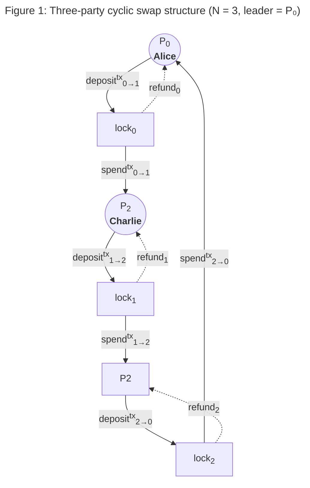

# Cyclic Atomic N-party Swap (CANS) Protocol

## Trustless Cross-chain Swaps via Adaptor Signatures

### Motivation

Bitcoin commands the largest store of value in cryptocurrency, 
with approximately one trillion dollars in market capitalisation. 
Yet this vast liquidity sits largely idle. Bitcoin's scripting language is intentionally limited, 
offering no native support for the rich decentralised finance (DeFi) primitives 
that have flourished on programmable blockchains. 
Cardano, by contrast, provides a mature ecosystem of oracles, 
decentralised exchanges, lending protocols, and liquid staking, but lacks Bitcoin's deep liquidity pool.

The Cyclic Atomic N-party Swap (CANS) protocol, developed by Input Output Global (IOG), 
was conceived to bridge this gap. 
Rather than relying on custodial bridges, wrapped tokens, or centralised intermediaries
– all of which introduce trust assumptions and single points of failure – 
CANS enables participants to exchange assets across blockchains in a fully trustless manner. 
The protocol's cyclic structure (P1 → P2 → … → Pn → P1) means each participant sends exactly once 
and receives exactly once, supporting arbitrary swap topologies including same-chain (BTC→BTC, ADA→ADA) 
and cross-chain (BTC→ADA, ADA→BTC) legs within a single atomic session.

### The Problem

Existing cross-chain swap solutions suffer from several fundamental limitations. 
Traditional hash time-locked contracts (HTLCs) require on-chain hash revelation, 
which leaks information and scales poorly beyond two parties. 
Centralised bridges and wrapped-asset schemes demand trust in a custodian, 
creating honeypots for attackers and regulatory risk. 
Multi-party swaps have historically required complex coordination protocols or trusted third parties to orchestrate.

The core problem CANS addresses is: **how can N parties on heterogeneous blockchains atomically exchange assets 
without trusting each other or any intermediary, while maintaining efficiency and scalability?**

An additional complication arises from the cryptographic mismatch between chains. 
Bitcoin uses the _secp256k1_ elliptic curve with _Schnorr_ signatures (via _Taproot_), 
while Cardano's native cryptography is based on _ed25519_. 
Any cross-chain protocol must bridge this gap without compromising security guarantees.

### Technical Achievements

We provide a Rust reference implementation which delivers a fully functional swap daemon 
that orchestrates the complete protocol lifecycle. 
The key technical achievements span cryptography, blockchain integration, software architecture, and formal verification.

- **Adaptor Signatures with MuSig2**
  The protocol's atomicity relies on adaptor signatures, it combines the signatures of the parties in a way t
  that is indistinguishable from any other signature in the involved blockchains and assures 
  the fact the adaptor signature is valid only if all parties reached an irrevocable agreement.

- **Cross-Curve Bridge via Smart Contract Validator**
  The most significant cryptographic challenge - bridging between different cryptographic curves - 
  is solved through the smart contracts implementing the adaptor signature logic for the blockchains 
  not supporting them natively.

- **Finite State Machine Architecture**
  The swap daemon is structured around a deterministic finite state machine (FSM) that governs the protocol lifecycle: 
  from key exchange and secret commitment, through lock transaction construction and broadcast, 
  to spend execution or refund. 
  The FSM ensures that each participant progresses through states consistently, 
  with clear transitions for both the happy path (all parties cooperate) and abort scenarios (any party disappears). 
  Refunds are staggered using configurable per-hop time windows, guaranteeing that if any participant aborts, 
  all others can safely reclaim their funds.

- **N-Party Scalability**
  The implementation scales to N participants in a single atomic swap session. 
  Regression tests validate correct behaviour with up to 20 concurrent parties, 
  each running an independent daemon instance.
  The test infrastructure uses a fully containerised environment with Bitcoin and Cardano nodes.

- **Formal Methods Verification**
  The protocol's safety and liveness properties have been formally verified, providing mathematical guarantees 
  that the protocol cannot result in loss of funds under the stated threat model. 
  This work complements the reference implementation and strengthens confidence in the protocol's correctness.

- **Dynamic Fee Handling**
  The implementation supports configurable Bitcoin fees per session and dynamic Cardano fee computation 
  based on execution units, transaction size, and protocol parameters, 
  a practical necessity for real-world deployment where fee markets fluctuate.

### Challenges Faced

- **Cryptographic Heterogeneity**
  The most demanding challenge was reconciling Bitcoin's and Cardano cryptographic curves. 
  The solution - embedding an adaptor signature verifier inside a Cardano smart contract - 
  required careful implementation to ensure that signature verification across curves maintained the atomicity guarantee.
  Any error in the bridge logic could break the protocol's all-or-nothing property

- **Time Coordination**
  Staggering refund time-locks across N participants on heterogeneous chains - 
  each with different block times and slot durations - required careful calibration. 
  The refund windows must be ordered such that the last participant in the cycle can always refund before earlier 
  participants, preventing a scenario where one party claims funds while another's refund window has already expired.

- **Asynchronous Protocol Coordination**
  With N independent daemons communicating over TCP, handling network partitions, message ordering, 
  and partial failures added significant engineering complexity. 
  The FSM-based architecture proved essential for managing this complexity, 
  providing deterministic state transitions regardless of message arrival order.

- **Testing at Scale**
  Validating a multi-party cross-chain protocol requires orchestrating multiple blockchain nodes, 
  multiple daemon instances, and realistic transaction flows. 
  The containerised test environment, while effective, demanded significant infrastructure engineering 
  to ensure reproducible and reliable test execution.

### Conclusion

The CANS reference implementation demonstrates that trustless, multi-party, cross-chain atomic swaps 
are practically achievable. 
By combining MuSig2 adaptor signatures with smart contract-based cross-curve verification, 
the project establishes a pattern that can extend beyond Bitcoin and Cardano to any pair of blockchains. 
The work - spanning cryptographic protocol design, systems engineering in Rust, formal verification, 
and comprehensive testing - provides a solid foundation for future production implementations 
that could unlock Bitcoin's liquidity for the broader DeFi ecosystem.
