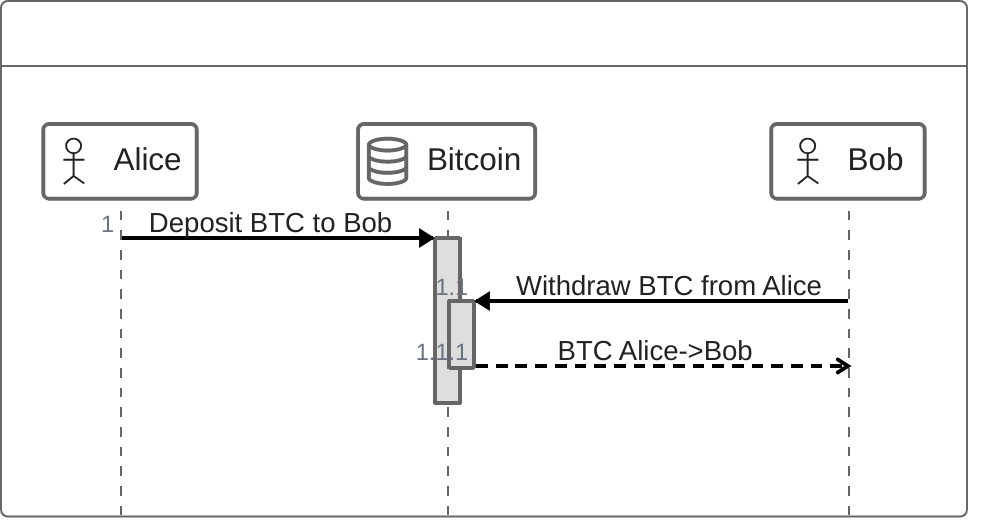

# 1. Introduction and Goals

## 1.1 Requirements

### 1.1.1 Motivations

Bridges are the primary pathway for capital to enter the Cardano ecosystem,
yet they remain one of the highest-risk components in blockchain systems.

While multiple interoperability solutions are emerging
– such as Bitcoin bridges, cross-chain messaging layers, and native atomic swaps –
their security assumptions, adversarial resilience,
and operational guarantees are not yet fully formalised or independently validated at a system level.
Bridges, being a single point of failure, have lost >$2B to exploits.

At the same time, blockchains remain largely passive systems, unable to act directly within external environments.
Untapped liquidity: Bitcoin has the largest store of value in crypto, approx $1 trillion in market cap, not earning
interest.

Cardano has rich programmable finance: oracles, DEXs, lending & borrowing, liquid stacking – but not Bitcoin’s
liquidity.

---

This system-level work therefore focuses on delivering high-assurance security foundations and trust-minimal
interoperability protocols that strengthen existing bridge infrastructure, enable trust-minimised cross-chain execution,
and position Cardano as a reliable coordination layer across ecosystems. external system interaction.
(i) Formal Security Analysis of Bridge Infrastructure

If you sell one for the othe, lose exposure and potentially taxable event.

CEXs impose custody risk, KYC requirements, and settlement delays
Atomic swaps require no custodian, no shared pool. You own the asset.
HTLC-based atomic swaps publish a common hash on both chains — trivially linking both swap legs for chain analysts
HTLC ring swaps lock sequentially — each hop waits for the previous confirmation, making total lock time O(N ×
block_time); timeouts must be staggered by the same factor
Goal: Atomic swap that is efficient, trustless, private, and has minimal on-chain footprint
---

This stream develops trust-minimised mechanisms for cross-chain asset exchange without intermediaries. Using adaptor
signatures and multi-party constructions, it enables atomic settlement across assets and chains, including 2-party and
n-party swap protocols (eg, CANS).
These primitives form the foundation for intent-based cross-chain execution, where users express high-level outcomes,
and solvers coordinate fulfillment through atomic transaction bundles. The work evaluates scalability, composability,
and deployment feasibility, with the goal of providing secure, reusable building blocks for interoperability.

## 1.2 Goals

Bitcoin scripting is intentionally limited for security reasons, so no native lending, no DEX, no stable-coins.

Enabling Cardano to function as an active coordination layer
– through secure cross-chain execution, threshold signing, and asset control –
requires new cryptographic primitives and stronger formal guarantees.

Either all spend txs complete, or all refunds fire. If any participant aborts, time-locked refunds guarantee no
participant loses funds
N-party: Scales to N participants — same ring protocol handles 3 or 20 counterparties with no structural changes
Supports same-chain or cross-chain legs (BTC ↔ ADA, ADA ↔ ADA, BTC ↔ BTC)
Participants need only trust the cryptographic protocol — not each other
Scriptless on Bitcoin: Taproot key-path spend is indistinguishable from a regular transfer
Happy path is quick (refund is no quicker)

---

## 1.3 Stakeholders

| Organisation                                  | Role      | Contact                   | Expectations                                                                                                                         |
|-----------------------------------------------|-----------|---------------------------|--------------------------------------------------------------------------------------------------------------------------------------|
| **App Research & Creative** (ARC) Engineering | Developer | nicolas.biri@iohk.io      | Delivery of the reference implementation open-source: 1. Architecture, 2. Code,  3. Documentation, 4. Formal Methods. |
| **Cardano Business Unit** (CBU)               | User      | michael.smolenski@iohk.io | Adopt the CANS protocol:  1. Present CANS to Cardano community, 2. Use the reference implementation to develop applications. |                                                                   
 