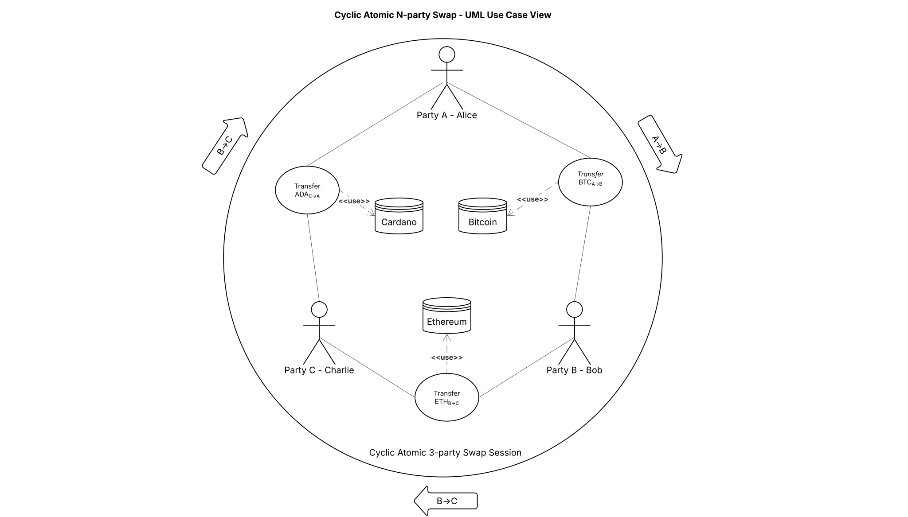
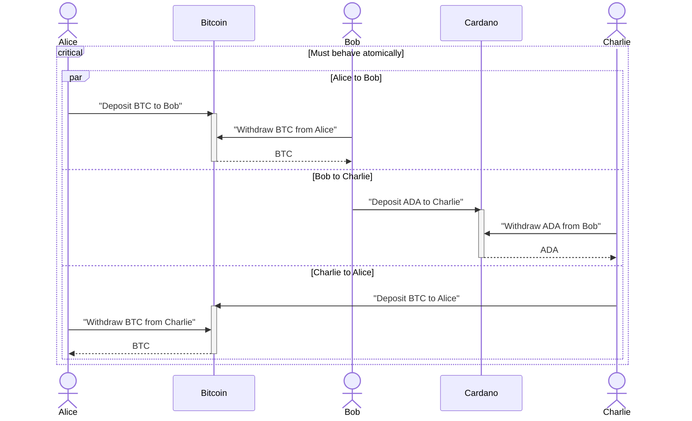

# 1. Introduction and Goals

## 1.1 Requirements

Bitcoin has the largest store of value in crypto, approx $1 trillion in market cap, not earning interest.

Cardano has rich programmable finance: oracles, DEXs, lending and borrowing, liquid stacking – but not Bitcoin’s
liquidity.

_Bridges_ or _Central Exchange_ (CEX) operators are the primary pathway for capital to enter the Cardano ecosystem,
yet they remain one of the highest-risk components in blockchain systems.

While multiple interoperability solutions are emerging
– such as Bitcoin bridges, cross-chain messaging layers, and native atomic swaps –
their security assumptions, adversarial resilience,
and operational guarantees are not yet fully formalised or independently validated at a system level:
bridges have lost >$2B to exploits so far.

The [Business Analisis](1_iag_ba.md) describes the market opportunity and motivates the need for this work as an element 
of the [Cardano 2030 Strategic Framework](https://product.cardano.intersectmbo.org/vision/strategy-2030/).

**This work focuses on delivering high-assurance security foundations and trust-minimal
interoperability **protocol** to enable trust-minimised cross-chain execution, 
un-tapping dormient Bitcoin liquidity to complex finance operations through Cardano as a reliable infrastructure.**
 

> Figure 1: CANS Protocol - Use Case Diagram: three parties, three blockchains.

---

## 1.2 Goals

1. Propose a **Cyclic Atomic N-party Swap (CANS) Protocol** to combine complex multi-party operations
   as it would be a single swap operation.
   1. **CYCLIC**: P1 → P2 → … → Pn → P1: 
    each participant sends exactly once and receives exactly once.
   2. **ATOMIC**: Either all spend txs complete, or all refunds fire.
     If any participant aborts, time-locked refunds guarantee no participant loses funds
   3. **N-party**: Scales to N participants with no structural changes.
   4. Supports same-chain or cross-chain legs (BTC ↔ ADA, ADA ↔ ADA, BTC ↔ BTC).
   5. Participants need only trust the cryptographic protocol — not each other.
   6. Scriptless on Bitcoin: Taproot key-path spend is indistinguishable from a regular transfer
2. Model the **Cyclic Atomic N-party Swap (CANS) Protocol** to address risks of competing solutions.
   1. <u>Bridges</u>
      1. Bridges use wrapped tokens (lets you keep exposure) that you can then yield; CANS protocol doesn't.
      2. Most bridges require a trusted third-party/custodian to upgrade the contract logic, pause or drain the bridge;
         CANS protocol doesn't.
      3. Don't require any asset custodian to trust.
   2. <u>Hash-based Time Lock Contracts (HTLC)</u>
      1. CEXs impose custody risk, _Know Your Customer_ (KYC) requirements, and settlement delays; 
       CANS protocol requires no custodian, no shared pool. You own the asset.
      2. HTLC-based atomic swaps publish a common hash on both chains — trivially linking both swap legs for chain analysts;
      CANS transactions are indistinguishable from any other transaction in the blockchains involved.   
      3. HTLC ring swaps lock sequentially — each hop waits for the previous confirmation, 
      making total lock time O(N × block_time); timeouts must be staggered by the same factor;
      CANS is efficient, has minimal on-chain footprint, 
      and meaningfully faster to succeed if all parties reach the consensus.
3. Provide a [**Formal Methods**](https://en.wikipedia.org/wiki/Formal_methods) model to verify the correctness for
   the properties of the CANS protocol.
4. Publish a [**Reference Implementation**](../../swap-daemon) 
   to demonstrate the feasibility and usability of the CANS protocol.

> Figure 2: CANS Protocol - Sequence Diagram: three parties, two blockchains.

---

## 1.3 Stakeholders

| Organisation                                  | Role      | Contact                   | Expectations                                                                                                                         |
|-----------------------------------------------|-----------|---------------------------|--------------------------------------------------------------------------------------------------------------------------------------|
| **App Research & Creative** (ARC) Engineering | Developer | nicolas.biri@iohk.io      | Delivery of the reference implementation open-source: 1. Architecture, 2. Code,  3. Documentation, 4. Formal Methods. |
| **Cardano Business Unit** (CBU)               | User      | michael.smolenski@iohk.io | Adopt the CANS protocol:  1. Present CANS to Cardano community, 2. Use the reference implementation to develop applications. |                                                                   
 