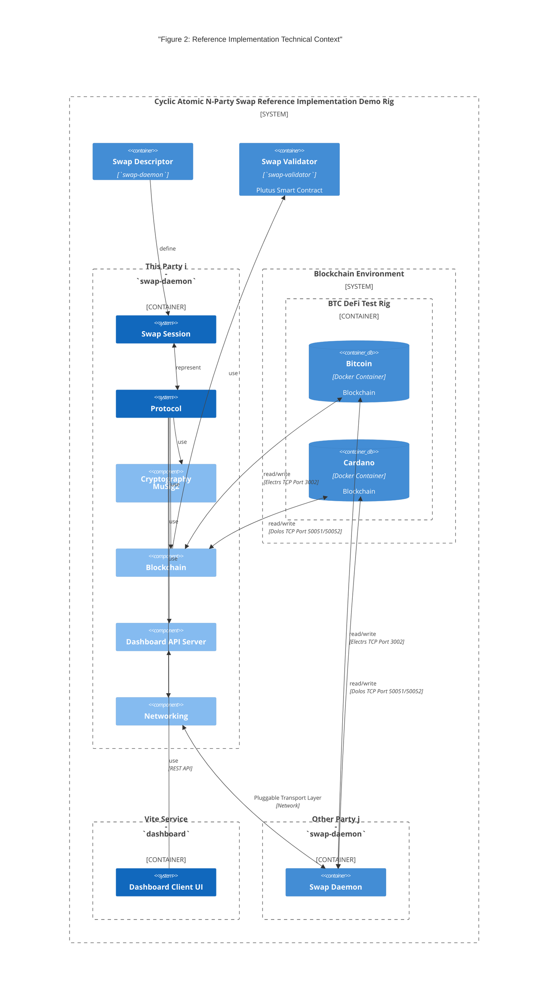

# 3. Context and Scope

The reference implementation is a demonstration of a decentralised swap protocol between Bitcoin and Cardano blockchains. 
It showcases the integration of two blockchains and the use of smart contracts implementing the CANS protocol.

## 3.1 Business Context

[`swap-daemon`](../../swap-daemon) provides the software to be integrated with the party's wallet

## 3.2 Technical Context

