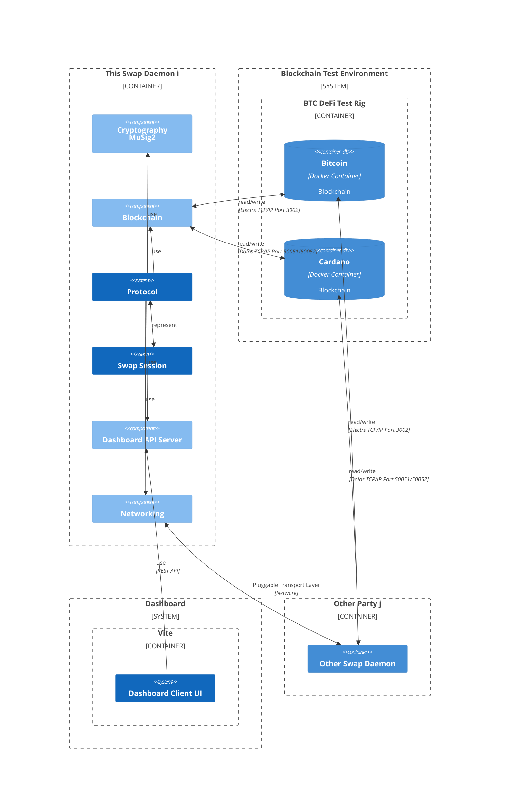

# 3. Context and Scope

```mermaid
C4Container
    Container_Boundary(daemon, "This Swap Daemon i") {
        Component(cryptography, "Cryptography<br/>MuSig2")
        Component(blockchain, "Blockchain")
        System(protocol, "Protocol")
        System(swap_session, "Swap Session")
        Component(dashboard_api_server, "Dashboard API Server")
        Component(networking, "Networking")
        BiRel(swap_session, protocol, "represent")
        Rel(protocol, blockchain, "use")
        Rel(protocol, cryptography, "use")
        Rel(protocol, networking, "use")
        Rel(protocol, dashboard_api_server, "use")
    }
    System_Boundary(blockchain_environment, "Blockchain Test Environment") {
        Container_Boundary(btc_defi_atomic_swaps_test_env, "BTC DeFi Test Rig",, "https://github.com/input-output-hk/btc-defi-atomic-swaps-test-env") {
            ContainerDb(bitcoin, "Bitcoin", "Docker Container", "Blockchain")
            ContainerDb(cardano, "Cardano", "Docker Container", "Blockchain")
        }
    }
    System_Boundary(dashboard, "Dashboard") {
        Container_Boundary(dashboard_vite, "Vite") {
            System(dashboard_client_ui, "Dashboard Client UI")
        }
    }
    Container_Boundary(p_j, "Other Party j") {
        Container(p_j_daemon, "Other Swap Daemon")
    }
%%    Container(swap_descriptor, "Swap Descriptor", "")
%%    System(swap_validator, "Swap Validator", "Plutus Smart Contract")
%%    Rel(blockchain, swap_validator, "use")
    Rel(dashboard_client_ui, dashboard_api_server, "use", "REST API")
    BiRel(blockchain, bitcoin, "read/write", "Electrs TCP/IP Port 3002")
    BiRel(blockchain, cardano, "read/write", "Dolos TCP/IP Port 50051/50052")
    BiRel(networking, p_j_daemon, "Pluggable Transport Layer", "Network")
    BiRel(p_j_daemon, bitcoin, "read/write", "Electrs TCP/IP Port 3002")
    BiRel(p_j_daemon, cardano, "read/write", "Dolos TCP/IP Port 50051/50052")


```