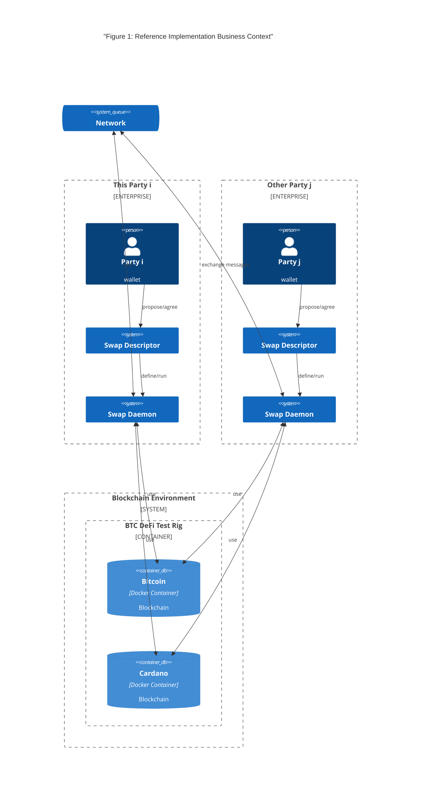
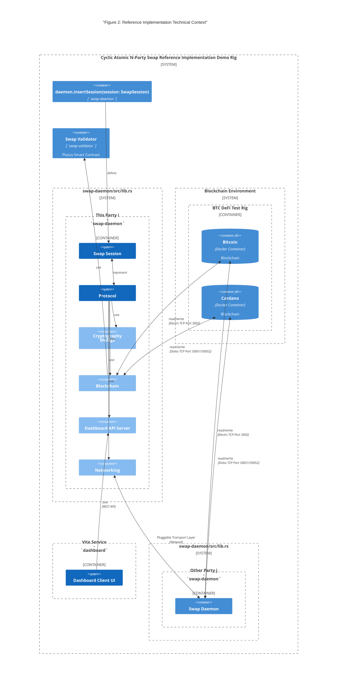

# 3. Context and Scope

The reference implementation provides a concrete demonstration of the CANS protocol 
between Bitcoin and Cardano blockchains. 
It showcases the integration of two blockchains and the use of smart contracts implementing the CANS protocol.

## 3.1 Business Context

The [`swap-daemon`](../../swap-daemon) provides the software _daemon_ to be integrated with the party's wallet.

In the business context, it is supposed each daemon for each party to represent runs in a separate process inside
a separate enterprise boundary.
The Enterprise boundary should bot be interpreted as on premisis services running in servers 
installed inside the walls of a company.
Imagining a Kubernetes cluster of pods on clouds, the set containers running the daemons representing a party are
a valid enterprise boundary.

The _daemon_ handles a swap descriptor for the party it represents and the other parties it interacts with to complete
the swap session.

- The index **i** identifies the party the daemon represents
- The index **j** identifies the other parties the daemon interacts with.

Each _daemon_ implements the [Finite State Machine](5_bbw_protocol.md) (FSM) the CANS protocol describes.

Each _daemon_ interacts with the blockchain.
This reference implementation provides integration code for Bitcoin and Cardano.
Each daemon interacts with Bitcoin or Cardano. 

Each _daemon_ exchanges messages with the other daemons, the messages allow the distributed FSM instances to evolve to 
the success or failure of the swap session. 

## 3.2 Technical Context

The reference implementation doesn't provide a party's wallet.
The wallet (keys, assets) and the terms and conditions of the swap are represented by the 
[`SwapSession`](../../swap-daemon/src/types.rs) and injected into the [`swap-daemon`](../../swap-daemon/src/daemon.rs) 
via the `pub fn insert_session(&mut self, session: SwapSession)` method.

The [lib.rs](../../swap-daemon/src/lib.rs) exposes what is needed to build a crate representing
a party or building a runtime rig serving the multiple parties of the CANS protocol.

Tests code at [regtest](../../swap-daemon/tests/regtest) provides a runtime rig for testing the swap daemon
hosting up to twenty parties.

Daemons use a pluggable transport layer to connect through the network to other demons, TCP is used by default.
Daemons are blockchain API clients
- **Bitcoin**: Electrs API TCP Port 3002
- **Cardano**, Dolos API TCP Port 50051/50052"

