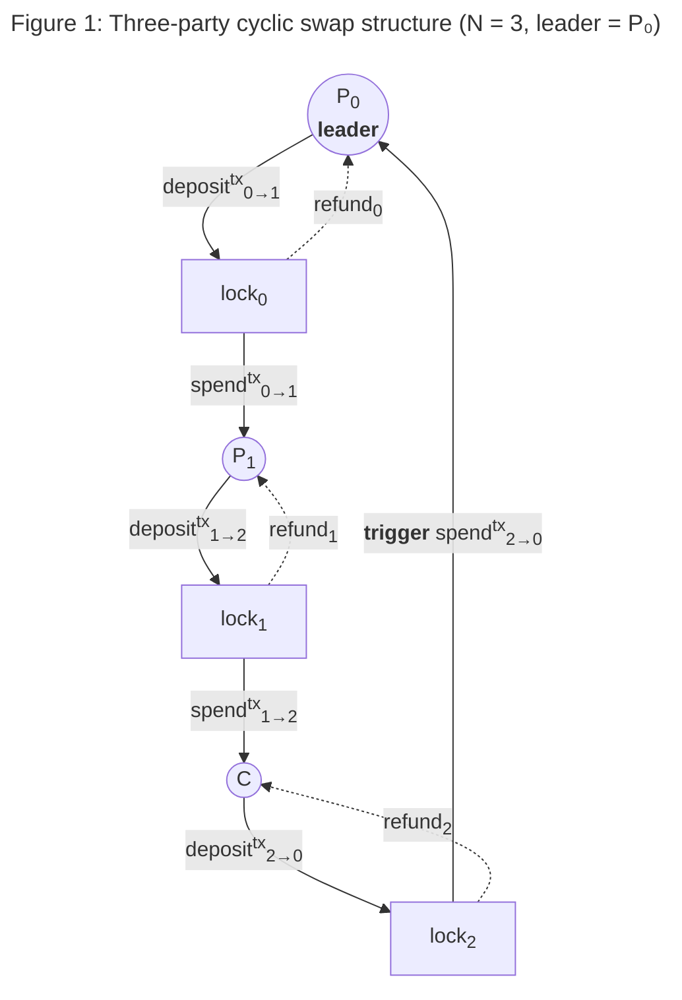
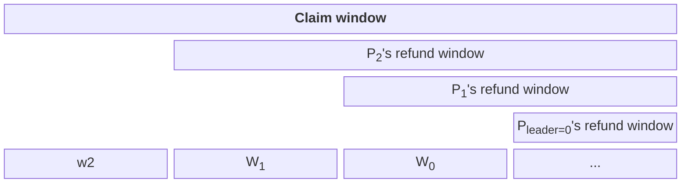
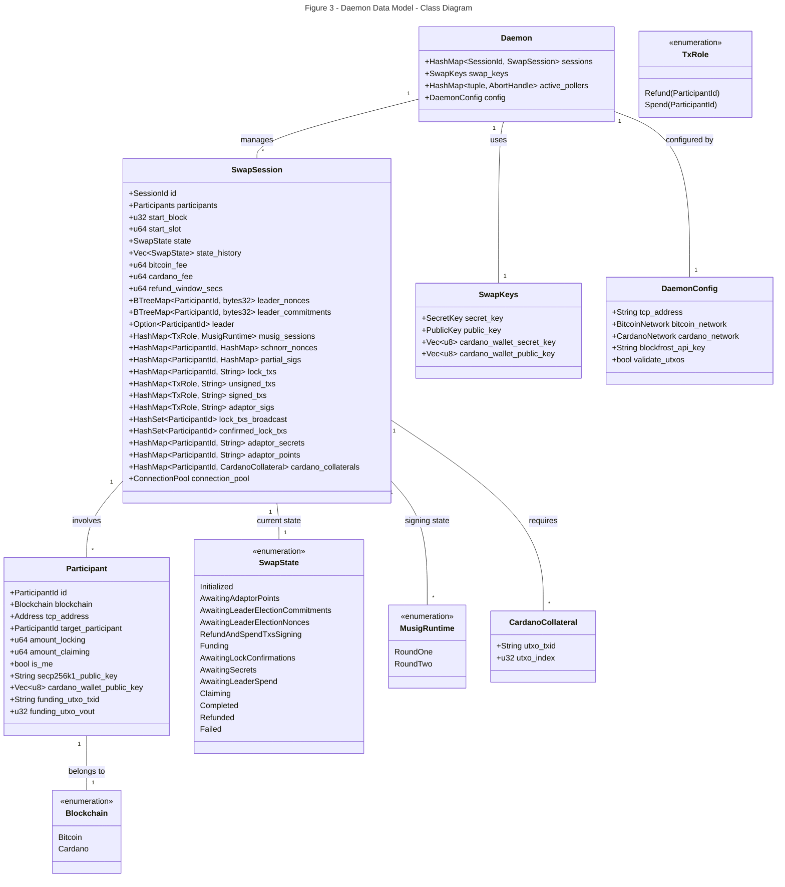
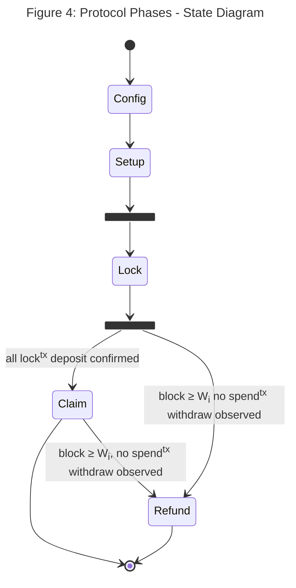

# 5. Building Blocks View

## 5.1 Context Setting

### 5.1.1 Parties

The solution defines a finite set of N parties 

P = {P0, P1, ..., PN−1 }.

An index identifies each party. In this document the index

- **i** represents the party from its subjecting point of view: "who I am";
- **j** represents the other parties from the perspective Pi: "who I am not".
- **leader** represents the party elected as leader at runtime via a commit-reveal scheme.

Each party is represented by a daemon process, running concurrently, observing the blockchain it uses to swap
and exchanging messages with the other parties' daemon.

Each party operates on one of two supported blockchains: 
Bitcoin (Taproot / MuSig2 key-path spend) or Cardano (Plutus V2 script).
Parties may use different blockchains, enabling cross-chain swaps.

### 5.1.2 Directed Cycle

The parties are arranged in a directed cycle encoded by each participant’s 
`types::Participant.target_participant` field: 

P0 → P1 → P2 → · · · → PN−1 → P0.

Each directed edge defines one transfer.

### 5.1.3 Transfers

**Transferi** is the transfer from Pi to P(i+1) mod N, 
for i = 0, ..., N−1.

**Roles**. Because the swap is cyclic, every party plays all three of the following roles
simultaneously.

- **Depositor** for transferi: Pi signs and writes the **locktx**i
  to _deposit_ funds on-chain.
- **Claimant** for transfer(i−1) mod N: Pi signs with all Pj,  
  then it writes the **spendtx**(i−1) mod N on chain 
  to _withdraw_ the funds deposited by the locktx(i−1) mod N.
- **Refunded** for transferi: Pi signs with all Pj,
  then it writes the **refundtx**i on chain;
  the transaction will be finalised to recover the funds in the case any swap of the cycle fails.
- **Co-signer** for all N transfers: Pi contributes its public key, nonce, and partial 
  pre-signature to the multi-signed spendtx. 
  The spendtx cannot be committed if any party disagrees, where the full consensus
  among participants is the purpose of this protocol. 

The terms _sender_ and _receiver_ are used below only as shorthand for the **depositor** and
**claimant** roles within a specific transfer. They do not denote distinct categories of parties.

The leader Pleader is the claimant in transferleader−1 
Until the Claim phase, all parties execute identical protocol steps, 
differing only in which transfer index they are depositing into and claiming from.
The only asymmetry in the protocol is in the
Claim phase where the leader’s behaviour diverges from that of all other parties.

> Solid arrows: lock (deposit) and spend (claim) paths.
> Dashed arrows: refund path (time-locked, unhappy path only).
> The **trigger** is the first spendtx broadcast, by leader P0 claiming PN-1's locked funds.

---

## 5.2 Core Concepts Data Representation

### 5.2.1 Keys

Each party Pi holds two key pairs, stored in a `types::Daemon.SwapKeys` struct.

- A **Secp256k1** key pair used for MuSig2 multi-signature operations and Plutus script verification on Cardano.
- An **Ed25519** key pair used to sign the Cardano locktx input itself (the funding UTxO spending witness) 
  and to provide collateral witnesses on Cardano spend and refund transactions.

Makes sense that there is just one pair of private and public keys for the daemon.
These will probably come from a wallet.

The **Secp256k1** public keys are exchanged during the Config phase of the swap session;
the **Ed25519** keys are used locally and not exchanged.

### 5.2.2 Aggregate Adaptor Secret

Each party Pi generates a private **adaptor secret** ti 
uniformly at random during session initialisation. 
The corresponding public **adaptor point** is:

Ti = ti · G

where G is the **Secp256k1** generator.
Ti is broadcast to all parties as the start of the Setup phase with the first wire message (`AdaptorPoint`).
The **aggregate adaptor point** T>agg is the sum of all individual adaptor points.
The corresponding **aggregate adaptor secret** is:

tagg = t0 + t1 + … + tN−1

This single secret adapts the pre-signature for **every** spendtx.
It is distributed: no strict subset of parties can compute it unilaterally.

### 5.2.3 Transactions Per Transfer

For each transferi, three transactions are constructed during the signing phase 
(`types::SwapState::RefundAndSpendTxsSigning`):

| Transaction                      | Spends                       | Produces                                | Authorisation                                    |
|----------------------------------|------------------------------|-----------------------------------------|--------------------------------------------------|
| **Deposit: locktx**   | Pi's funding UTXO | Locked account for transferi | Signature of Pi's alone.              |
| **Withdraw: spendtx** | Locked account               | P(i+1) mod N's address       | MuSig2 aggregate sig + tagg (adaptor) |
| **Refund: refundtx**  | Locked account               | Pi's address                 | MuSig2 aggregate sig + locktime ≥ Wi  |

- The **spend tx** is co-signed as an _adaptor pre-signature_:
  it becomes a valid signature only when tagg is applied.
- The **refund tx** is fully co-signed during the Setup phase 
- but time-locked and cannot be broadcast before block height Wi.

### 5.2.4 Locked Account

Each transfer’s locked account is an N-of-N multi-signature account.
Its unlocking key is an aggregated public key derived from all N parties’ individual public keys. 
Spending it requires a single aggregated Schnorr signature committing all N parties.

**Mutual exclusion assumption.** For each transfer’s locked account, the underlying chain
guarantees that at most one of the spendtx and the refundtx can be confirmed.
In UTXO-based chains this holds structurally (spending a UTXO consumes it, invalidating any
other transaction that references it); other chain models must enforce it explicitly.

- **Bitcoin:** A Pay-to-Taproot output whose internal key is the MuSig2 aggregate public key 
Xagg = X0 + … + XN−1 (key-path spend, with Taproot tweak applied).

**Cardano:** A Plutus V2 script address. The script validates `verify_schnorr(agg_pubkey, lock_txid, sig)`, 
where `agg_pubkey` is derived from all N **Secp256k1** public keys and `lock_txid`
is the transaction ID of the lock tx itself, 
computed calling `protocol::chain_monitor::bitcoin_txid(tx_hex: &str) -> String`.
Cardano transactions require _collateral_ UTxO; each participant provides their own, stored in `cardano_collaterals`.

### 5.2.5 Refund Windows

Each transferi has an associated refund window open height Wi: 
the minimum block height of a chosen blockchain at which the refund tx for transferi becomes valid.

**Staggered window invariant (cyclic case):**

W0 > W1 > W2 > ··· > WN−1.

The leader Pleader ’s refund window opens **last**. Pleader−1’s
refund window (for the deposit into the leader) opens **first**.

**Minimum gap requirement.**
Let ∆ be the claim propagation time: 
the maximum number of blocks required for a party to 
(1) observe a broadcast transaction at the required finality depth, 
(2) construct and sign the corresponding spendtx, and 
(3) have it confirmed to the required finality depth.
The staggered ordering alone is not enough for safety; the gaps must satisfy:

Wi − Wi+1 ≥ ∆ for all i = 1, 2, ..., N-2.

∆ is a protocol parameter that must be fixed before the Config phase and depends on
the confirmation-depth policies of the relevant blockchains. This value **must be chosen
conservatively** as the security of the protocol depends entirely on it.

> **Security note.**
> If Wi − Wi+1 < ∆, a malicious leader (the only party that controls the
> trigger broadcast) can allow Wi+1 to expire before P(i+1) mod N can confirm its spendtx.
> P(i+1) mod N then claims a refund, but the adversary also claims P(i+1) mod N ’s deposit via
> the spendtx: that party loses their deposit and receives nothing, breaking atomicity.

**Griefing opportunity cost asymmetry.**
Because refund windows are staggered, an
abort imposes unequal waiting costs on different parties. If any party aborts after the Lock
phase, every party eventually recovers their principal via the refund path; no principal is lost.
However, a party with a small Wj (refund available early) that withholds their adaptor secret
forces the leader, who holds the largest window W0, to keep funds locked for the longest
period. The aborting party bears a shorter opportunity cost than the leader does. This
asymmetry is a liveness concern, not an atomicity violation.

**Optionality.** 
The temporal gap between the Lock phase (when all funds are committed)
and the leader’s decision to broadcast the trigger creates a free option for the leader.
During this gap the leader can observe price movements and choose to complete the swap (if prices
moved favourably) or let it expire via refund (if prices moved against them). The non-leader
parties are locked in and cannot exit.
The protocol does not require the leader to broadcast the trigger within any deadline, 
nor does it impose a premium to compensate non-leaders for this optionality.
The refund path ensures no principal is lost, but expected value is transferred from non-leaders to
the leader through the option itself.
This is not specific to this protocol: it is a structural property of all atomic swap protocols 
(HTLC or adaptor-signature-based) in which one party commits last.

> Figure 2: Staggered refund windows for N = 3. W2 < W1 < W0. 
> The claim window is the period during which spendtx transactions may be broadcast. 

### 5.2.5 Refund Window Safety Argument

The staggered window invariant ensures that no coalition of parties can cheat an honest party
out of both their deposit and their output, _provided_ the minimum gap requirement is met.

**Formal invariant.** For the cycle P0 → P1 → ··· → PN−1 → P0 
with P0 as leader:

W0 > W1 > W2 > ··· > WN−1, 
with Wi<.sub> − Wi+1 ≥ ∆ for all i = 0, ..., N−2.

The claim propagation time ∆ is defined in Section 2.4. If ∆ gap condition is not met,
an adversary can exploit the timing t.

### 5.2.6 Data Model

### Daemon Data Model Class Diagram

The `types::Daemon` class (Rust struct and its implementation) is the pivotal object of the
CANS implementation. The **daemon** represents a party participating the swap session,
described by the `types::SwapSession` instance. The daemon evolves the state of the
`SwapSession` instances because the exchaning of messages with the daemons
representing the other participants and because the operations
performed on the chain.  

The following Mermaid diagram represents the data model of the `Daemon` and `SwapSession` structs 
and their associated proeprties and types as defined in [types.rs](../../swap-daemon/src/types.rs).
The data model represents the elements, concepts, and data described so far.
The rest of this document and the linked ones refer to the data model as shown in the diagram.

#### Key Components:
- `Daemon`: The central orchestrator managing multiple swap sessions, configuration, and global keys.
- `SwapSession`: Represents an active atomic swap protocol instance, tracking its state, participants, and cryptographic material (MuSig2, adaptor signatures).
- `Participant`: Contains metadata about a counterparty in a swap, including their blockchain addresses and public keys.
- `SwapState`: An enumeration of the various phases of the BBW (Bitcoin-to-Cardano) protocol.
- `SwapKeys`: The daemon's own cryptographic keys used for signing transactions on both Bitcoin (secp256k1) and Cardano (Ed25519).

---

## 5.3 Protocol Phases

Each transfer independently progresses through five phases.

- [Config](5_bbw_protocol.md#532-config-phase)
- [Setup](5_bbw_protocol.md#533-setup-phase)
- [Lock](5_bbw_protocol.md#534-lock-phase)
- [Claim](5_bbw_protocol.md#535-claim-phase)
- [Refund](5_bbw_protocol.md#536-refund-phase)

Phases for different transfers run concurrently but are synchronised at two global barriers **Lock** and **Claim**.

Follow the above links for the [detailed explanation of the protocol](5_bbw_protocol.md) building blocks,
the comprehensive state diagram of the protocol is visible in
[horizontal](5_bbw_fsm_lr.mmd) or
[vertical](5_bbw_fsm_td.mmd) orientation.

---

## 5.4 Wire Messages

All off-chain communication uses `Envelope`-wrapped `WireMessage` values serialised with `serde_json` and sent over 
persistent TCP connections managed by the `ConnectionPool` (`Arc<Mutex<HashMap<String, Arc<Mutex<TcpStream>>>>>`).
Reusing connections avoids exhausting OS ephemeral ports under high message volume. 
Each message is wrapped in an `Envelope` carrying the `session_id` and the sender's `participant_id`.

| Message                          | Description                                                                       |
|----------------------------------|-----------------------------------------------------------------------------------|
| `AdaptorPoint(point)`            | Broadcasts this party's adaptor point T_i (hex string)                            |
| `LeaderElectionCommitment(c)`    | Broadcasts SHA-256 commitment to this party's 32-byte election nonce (`[u8; 32]`) |
| `LeaderElectionNonce(n)`         | Reveals the 32-byte nonce after all commitments received (`[u8; 32]`)             |
| `SchnorrNonce { role, nonce }`   | MuSig2 Round 1: public nonce for a specific `TxRole`                              |
| `PartialSignature { role, sig }` | MuSig2 Round 2: partial (pre-)signature for a specific `TxRole`                   |
| `LockTxBroadcast`                | Notification that this party has submitted its lock tx                            |
| `SecretReveal(secret)`           | Non-leaders reveal their adaptor secret t_j (hex-encoded secp256k1 scalar)        |
| `SpendTxBroadcast`               | Leader notifies peers that its spend tx (trigger) is on-chain                     |

---

## 5.5 Per-Party State

The complete local state of party Pi throughout the protocol (`types::SwapSession`):

| Field                   | Type                | Set in                        | Description                                           |
|-------------------------|---------------------|-------------------------------|-------------------------------------------------------|
| `adaptor_secrets`       | `HashMap`           | Config                        | Own ti; others' tj on receipt   |
| `bitcoin_fee`           | `u64`               | Config                        | Bitcoin tx fee (satoshis)                             |
| `cardano_collaterals`   | `HashMap`           | Config                        | Collateral UTxOs per party                            |
| `cardano_fee`           | `u64`               | Config                        | Cardano base fee (lovelace)                           |
| `connection_pool`       | `ConnectionPool`    | Config                        | Persistent TCP connections to peers                   |
| `id`                    | `SessionId`         | Config                        | Unique session identifier                             |
| `participants`          | `BTreeMap`          | Config                        | Ordered party list                                    |
| `refund_window_secs`    | `u64`               | Config                        | Per-hop window (604 800 s)                            |
| `start_block`           | `u32`               | Config                        | Bitcoin block at session creation                     |
| `start_slot`            | `u64`               | Config                        | Cardano slot at session creation                      |
| ----------------------- | ------------------- | -----------------             | ----------------------------------------------------- |
| `state`                 | `SwapState`         | Runtime                       | Current state                                         |
| `state_history`         | `Vec<SwapState>`    | Runtime                       | Chronological state log                               |
| ----------------------- | ------------------- | -----------------             | ----------------------------------------------------- |
| `adaptor_points`        | `HashMap`           | Setup: Adaptor Point Exchange | All Tj                                     |
| `adaptor_sigs`          | `HashMap<TxRole>`   | Setup: MuSig2 Pre-Signature   | Adaptor pre-sigs for spend txs                        |
| `leader_commitments`    | `BTreeMap`          | Setup: Leader Election        | cj from each party                         |
| `leader_nonces`         | `BTreeMap`          | Setup: Leader Election        | nj from each party                         |
| `leader`                | `Option<PID>`       | Setup: Leader Election        | Elected leader                                        |
| `lock_txs`              | `HashMap`           | Setup: MuSig2 Pre-Signature   | Hex-encoded unsigned lock txs                         |
| `musig_sessions`        | `HashMap<TxRole>`   | Setup: MuSig2 Rounds          | Per-role MuSig2 runtime                               |
| `partial_sigs`          | `HashMap`           | Setup: MuSig2 Pre-Signature   | Collected partial sigs                                |
| `schnorr_nonces`        | `HashMap`           | Setup: MuSig2 Rounds          | Collected public nonces                               |
| `signed_txs`            | `HashMap<TxRole>`   | Setup: MuSig2 Pre-Signature   | Fully signed refund txs; adapted spend txs            |
| `unsigned_txs`          | `HashMap<TxRole>`   | Setup: MuSig2 Pre-Signature   | Unsigned refund / spend txs                           |
| ----------------------- | ------------------- | -----------------             | ----------------------------------------------------- |
| `confirmed_lock_txs`    | `HashSet`           | Lock                          | Parties with confirmed lock tx                        |
| `lock_txs_broadcast`    | `HashSet`           | Lock                          | Parties that broadcast lock tx                        |

---

## 5.6 Notes

**UTXO validation:** the daemon optionally validates each participant's funding UTXO 
before the session starts (`validate_utxos` flag, implemented in `chain_monitor::validate_funding_utxos`). 
Bitcoin UTXOs are checked against the mempool API (`/tx/{txid}/outspend/{vout}`); 
Cardano UTXOs are checked via Blockfrost or Dolos REST. 
This check is a liveness guard, not a security requirement.

**Non-cyclic swaps:** the staggered window invariant does not straightforwardly generalise to non-cyclic transfer graphs. 
Out of scope for this specification.

**Cross-chain finality:** the definition of "confirmed" is chain-specific. 
Bitcoin confirmation is checked via the mempool API (`/tx/{txid}/status`); 
Cardano confirmation is checked via Blockfrost (`/api/v0/txs/{txid}`) or Dolos REST (`/txs/{txid}`).

**Cardano collateral:** Plutus V2 transactions require collateral UTXO. 
Each party provides their own collateral; 
the Ed25519 collateral witness is added immediately before submission 
in `broadcast_my_spend_tx` and `broadcast_my_refund_tx` via `add_collateral_witness`.

**Cryptographic soundness:** the MuSig2 multi-signature scheme (via the `musig2` crate) 
and the adaptor signature construction are assumed correct and secure. 
The combination follows the scheme described in the MuSig2 paper.

**Leader bias:** the commit-reveal leader election is unbiasable by any single party 
but can be biased by a coalition that aborts after seeing unfavourable nonces (last-actor problem). 
Mitigations such as Verified-Random-Function-based election are out of scope.
