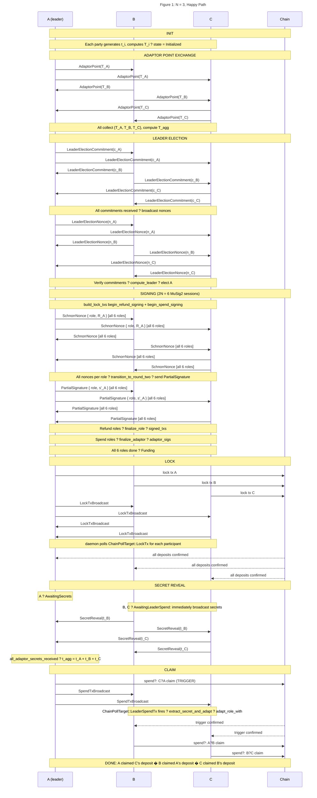
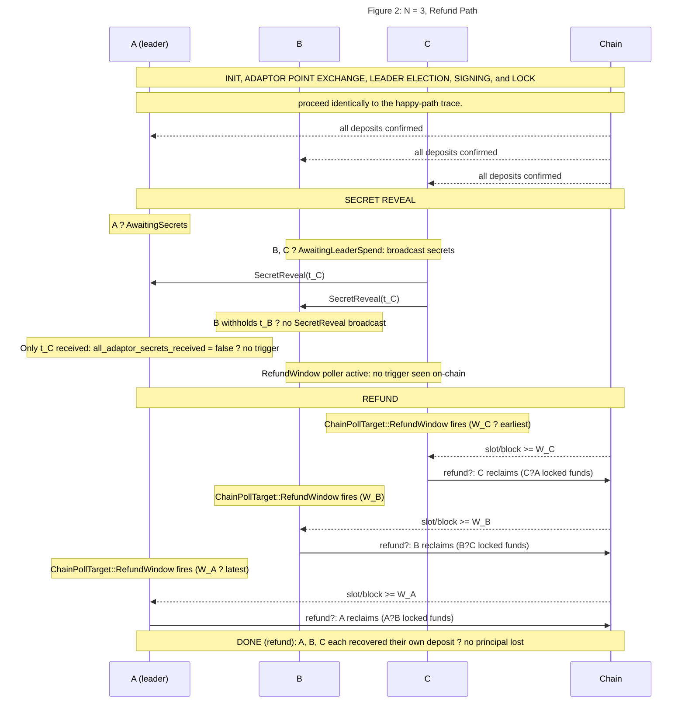

# 5 Building Blocks View - Protocol Examples

## Example Trace: N = 3, Happy Path

**Parties:** A, B, C — elected leader = A
**Cycle:** A → B → C → A
**Transfers:** tr₀ = (A→B), tr₁ = (B→C), tr₂ = (C→A) *(leader's received transfer)*
**Refund windows:** W_A > W_B > W_C *(leader's window latest)*

Once all locks are confirmed, B and C immediately broadcast their secrets and enter `AwaitingLeaderSpend`; A enters `AwaitingSecrets`.

---

## Example Trace: N = 3, Refund Path

**Parties:** A = leader, B, C
**Scenario:** B withholds t_B during the Secret Reveal phase. A never receives all secrets and does not broadcast the trigger. All parties fall through to the Refund phase via `ChainPollTarget::RefundWindow`.

> Refund windows fire in order WB < WC < WA
> (earlier window for parties farther from the leader).
> Each party independently broadcasts their refund tx via `broadcast_my_refund_tx`. 
> No principal is lost.

---
