# 5.3 Building Blocks View – The Protocol

## Typographic Conventions

### Parties

For a swap involving N parties, each party is identified by a number &ge; 0 and &le; N-1

- Pi: The party (who I am), for the transactioni,
  Pi identifies the _depositor_ writing the locktx on chain to deposit its funds.
- Pi+1 mod N: for the transactioni
  Pi+1 mod N is the _withdrawer_ writing the spendtx on chain to collect the funds
  deposited by Pi.
- Pj&ne;: Any other party who isn't Pi.

### Transactions

The code names the on chain transactions as follows:

- `refund`: it is the refundtx Pi writes on chain to _refund_ itself in case the swap fails.
- `lock`: it is the locktx Pi writes on chain to _deposit_ its funds \
  to be withdrawed by Pi+1.
- `spend`: it is spendtx the transaction when Pi+1 writes on chain
  to  _withdraw_ the funds deposited by Pi.

### Symbols

- **Annotation**
    - ✉ Off chain **message**: Unicode #9993
    - 🗎 **Note**: Unicode #128462
- **Concurrency and Parallelism**
    - ☈ **Interrupt** process: Unicode #9736
    - ↻ Periodic **poll** process: Unicode #8635
- **State**
    - 🔒 **MuSig round** transition: #128274
    - ⤞ Swap session **state transition**: Unicode #10526.

---

## 5.3.1 Protocol Phases

Phases for different transfers run concurrently but are synchronised at two global barriers **Lock** and **Claim**.

Phases are represented by the `types::SwapSession.state` of `SwapState` type.

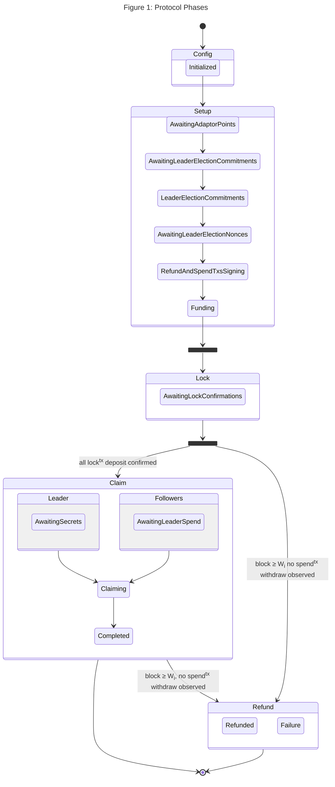

> **Figure 3** external boxes represent protocol phases,
> internal boxes represent the swap session state as `SwapState` instances.
> Once all lock txs are confirmed,
> the **leader** transitions to `AwaitingSecrets` (waiting for N−1 `SecretReveal` messages);
> **non-leaders** transition immediately to `AwaitingLeaderSpend` and simultaneously broadcast their adaptor secret.

---

## 5.3.2 Config Phase

**Goal.** Establish the swap parameters, have each party generate its private adaptor secret,
and confirm that all _N_ parties are willing to proceed before any cryptographic material is
exchanged between parties.

Config has two parts: a one-time global step and a per-transfer consent step.

**Part 1 — Swap description (once per swap).** The swap initiator distributes the **swap
description** to all _N_ parties: a unique swap identifier `swap_id`, the ordered party
list [P0, ..., PN −1],
the leader’s identity, and the proposed refund window heights W0, ..., WN −1.
Each party Pi records swap identifier, parties, and leader = Pleader,
and generates its private adaptor secret ti uniformly at random.

**Part 2 — Per-transfer consent.** For transferi, P(i+1) mod N proposes the swap description
to all N parties; each party either accepts or withholds consent. P(i+1) mod N proceeds to
the **Setup** phase only after receiving consent from all N parties.

**Pre-condition (for a party to consent):**

- The party has received the swap description: the transfer cycle, the complete ordered
  party list, the leader’s identity, and the proposed refund window heights W0, ..., WN−1.
- The proposed windows satisfy the staggered invariant W0 > W1 > · · · > WN−1 with gaps
  Wi − Wi+1 ≥ ∆.

The two parts, the swap description distribution and the consent handshaking,
are mocked in the implementation.
Code tests show how the parties initialise the `types::SwapSession`.

The `type::SwapSession` describes the state of the swap session through the protocol phases
from the point of view of each partecipant.
The `SwapSession` properties and the properties of structures it links, are described in
the class diagram below.

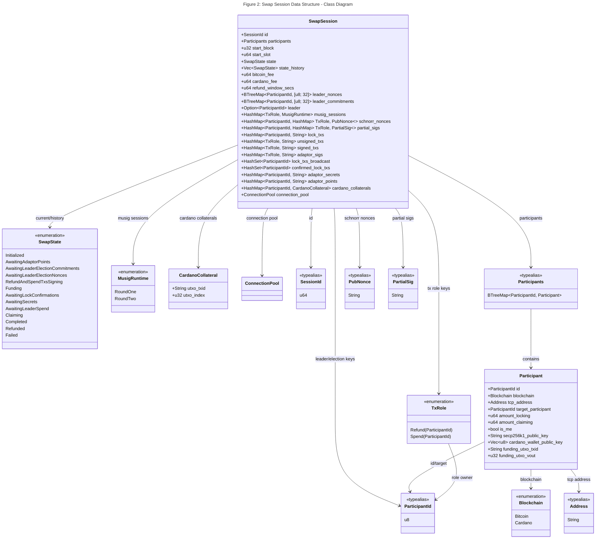

Each party calls `SwapSession::new` with:

- a unique `session_id`;
- the `participants` map (must form a valid directed cycle, verified by `check_cyclic`);
- `start_block` and `start_slot` (current chain tips);
- `bitcoin_fee` and `cardano_fee` in the respective chain's smallest units.

During the configuration each party:

- Generates 32 random bytes and interprets them as a **Secp256k1 scalar** ti (the adaptor secret).
- Computes the adaptor point Ti = ti · G and stores both.
- Sets the initial state to `SwapState::Initialized`.
- Sets `refund_window_secs` = 604 800 (7 days).

**Post-condition:** Every party holds the swap description and its own private adaptor secret ti.
All N parties have agreed on the swap description, and P(i+1) mod N may proceed to Setup
for transferi.

**Post-condition:** every party holds its own adaptor secret ti and adaptor point Ti.
State = `Initialized`.

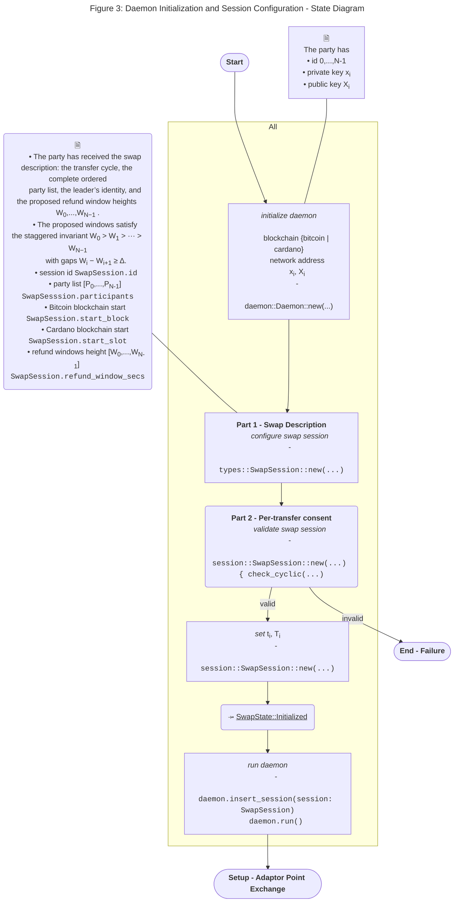

---

## 5.3.3 Setup Phase

**Goal.** Construct and mutually verify all three transactions for every transfer so that:

1. Everyone can independently compute Tagg.
2. For each transferi, P(i+1) mod N holds a verified pre-signature for the spendtx
   (completable once tagg is known, and not before).
3. For each transferi, Pi holds a fully co-signed, time-locked refundtx.
4. All parties have verified that every refund window Wi is correctly set.

### Adaptor Point Exchange

Setup begins with a one-time preliminary step in which every party broadcasts its individual
adaptor point Ti to all other parties.
This happens once per swap, before any per-transfer rounds begin.

When the daemon calls `start_swap_session`, it optionally validates all participants' funding 
UTxOs (`validate_utxos` config flag via `validate_funding_utxos`),
then calls `broadcast_adaptor_point` and transitions the session to `AwaitingAdaptorPoints`.

Each party broadcasts its adaptor point Ti as an `AdaptorPoint` wire message to all other participants.

On receiving an `AdaptorPoint` from participant j, each party:

1. Store Tj in `adaptor_points`.
2. If all N adaptor points have been received and the state is `AwaitingAdaptorPoints`,
3. transition to `AwaitingLeaderElectionCommitments` and call `start_leader_election`.

> **Note on concurrency:**
> if the first `LeaderElectionCommitment` arrives before all adaptor points are collected
> (possible under concurrent delivery), `start_leader_election` is triggered on the first commitment as well,
> ensuring it runs exactly once regardless of message ordering.

**Post-condition:** every party holds {T0, …, TN−1} and can compute Tagg = T
i + ΣTj.
State = `AwaitingLeaderElectionCommitments`.

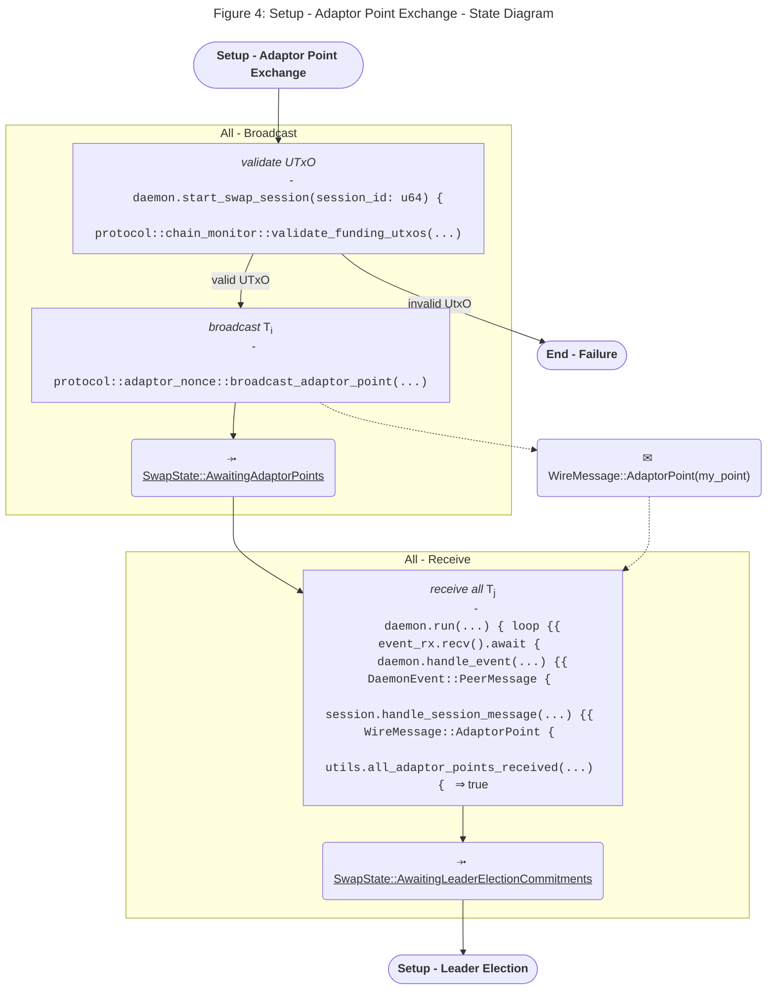

---

### Leader Election

**Goal:** elect a single leader via a commit-reveal scheme without any pre-assignment.

#### Commit Phase

On `start_leader_election`, each party Pi:

1. Generates a 32-byte random **nonce** ni via `OsRng`.
2. Computes the commitment ci = SHA256(ni) using the `bitcoin::hashes` crate.
3. Stores the nonce ni in `leader_nonces`
   and the commitment ci in `leader_commitments` under its own `ParticipantId`.
4. Broadcasts `LeaderElectionCommitment(c[i])` to all other parties.

On receiving a `LeaderElectionCommitment` from participant j:

1. If this party has not yet started leader election (own commitment is absent),
   call `start_leader_election` and transition to `AwaitingLeaderElectionCommitments`.
2. Store cj in `leader_commitments`.
3. If all N commitments have been received and the state is not yet `AwaitingLeaderElectionNonces`,
   broadcast `LeaderElectionNonce(n_self)` and transition to `AwaitingLeaderElectionNonces`.

#### Reveal Phase

On receiving a `LeaderElectionNonce` from participant j:

1. Verify SHA256(nj) = cj; **panic** if mismatch (`"Nonce invalid with commitment"`).
2. Store nj in `leader_nonces`.
3. If all N nonces have been received and `musig_sessions` is empty (i.e. signing has not yet been initialised),
   call `compute_leader`, transition to `RefundAndSpendTxsSigning`,
   call `build_lock_txs`, then concurrently call `begin_refund_signing` and `begin_spend_signing`.

#### Leader Computation

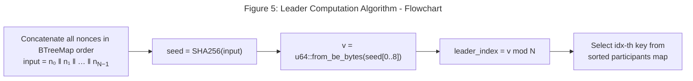

**Post-condition:** all parties agree on the same leader identity (stored in `leader`). State =
`RefundAndSpendTxsSigning`.

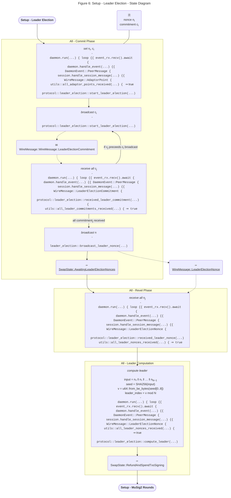

---

### MuSig2 Rounds

`lock_funds::build_lock_txs` builds a lock tx for every participant:

- **Bitcoin:** P2TR output sending `amount_locking` satoshis to the aggregate Taproot address
  derived from all N secp256k1 public keys.
- **Cardano:** Plutus script output sending `amount_locking` lovelace to the script address, minus `cardano_fee`.

#### Round 1 – Schnorr Nonce Exchange for spendtx

**Pre-condition:** Config phase represents the fact all parties agree about all trasfers.
Setup phase completed, the leader elected.

For each participant i, the refund locktime is computed by `refund_locktime_btc` / `refund_locktime_cardano`:

- Wi(BTC) = start_block + di> · (window_secs / 600)
- Wi(ADA) = start_slot + di · window_secs

where di = distance_from_leader(P_k)

Signing message for refundtx and spendtx:

- **Bitcoin:** Taproot sighash of the unsigned refundtx (`compute_sighash`).
- **Cardano:** raw 32-byte lock tx transaction ID (blake2b of the original body bytes,
  computed via `FixedTransaction` to preserve byte-level accuracy).
  The Plutus script checks `verify_schnorr(agg_pubkey, lock_txid, sig)`.

**Initiator** for transferi: P<sub<(i+1) mod N broadcasts Ri to all N parties.

Every party Pj responds with its public nonce Rj.
All parties compute the aggregate nonce Ragg = R0 + ··· + RN−1.

**Post-condition:** All parties are committed to specific nonce 
for partial signature computation for transferi.
Changing nonce after this point invalidates all collected partial
signatures, making the commitment binding by construction.

#### Round 2 – Partial Pre-Signature Exchange for spendtx

**Pre-condition:** Round 1 complete; all parties hold the individual adaptor points Tj for all j
(broadcast in the Preliminary step).

All parties collect the Schnorr nonce Rj and compute Ragg = Ri + ΣRj
for refundtxj and spendtxj.

Each party then computes and broadcasts the partial pre-signature si
using their own private key and Ragg for refundtx and spendtx.

Before computing its partial pre-signature, each responding party **must verify**:

- Tagg = T0 + T1 + ··· + TN−1, 
  computed independently of the individual adaptor points Tj broadcast in Round 1. 
- The spendtx being pre-signed spends the correct locked account 
  and credits P(i+1) mod N’s address for the agreed amount.

> **Security note.** 
> If co-signers do not verify Tagg, the initiating party can substitute 
> Tagg = Tagg + δ · G for an arbitrary scalar δ. 
> The resulting pre-signature requires tagg + δ to complete.
> That value is extractable on-chain after the trigger, but it is not tagg; 
> all other parties’ spendtx, which require tagg, become permanently invalid, 
> and the initiating party alone can claim.

Every responding party Pj computes its partial pre-signature s′j over the (verified) spendtx
for transferi and sends it to P(i+1) mod N. 
P(i+1) mod N assembles the aggregate pre-signature from all N responses 
and verifies it against the (verified) Tagg.

**Post-condition:** P(i+1) mod N holds a verified aggregate pre-signature 
for the spendtx of transferi.
This pre-signature is not a valid signature; it becomes one if and only if tagg/sub> is applied to it. 
No party can complete this withdraw tx without knowing tagg.

### MuSig2 Pre-Signature for spendtx

Pre-condition: Round 3 complete for transferi.

Once all N partial signatures for a refundtx and spendtx role are collected,
`finalize_role` assembles the full MuSig2 aggregate signature and stores the signed tx in `signed_txs`.

For each participant i, the spendtx spends the locked account of (i-1 (mod N))'s `target_participant`
(the party i is *receiving from*).

The target's blockchain determines the sighash/message:

- **Bitcoin target:** Taproot sighash of the unsigned spend tx.
- **Cardano target:** raw 32-byte lock tx transaction ID (same `FixedTransaction` approach).

For Cardano spend txs, the fee is fixed at 2 000 000 lovelace (`cardano_spend_fee`)
to cover the Plutus execution unit cost;
the output amount is `lock_utxo_value − cardano_spend_fee`.

Spend txs are signed as **adaptor pre-signatures** via `finalize_adaptor`: Tagg is mixed into the signing,
producing a pre-signature s'i that becomes valid only when tagg is applied.
The pre-signature s'i is stored in `adaptor_sigs`; no entry is written to `signed_txs` yet.

Before co-signing, each party must verify all the following:
- The locktx sends funds to the locked account address (not a substituted address).
- The locktx amount matches the agreed transfer amount for transferi.
- The refundtx spends the correct locked account for transferi.
- The refundtx credits Pi ’s address.
- The refundtx time-lock is exactly Wi.
- Wi is consistent with the window heights agreed in the Config phase and satisfies the
  staggered invariant (Wi−1 > Wi > Wi+1, 
  with boundary conditions at i = 0 and i = N −1).

> **Security note.** Without these checks, a malicious depositor can present a locktx that
> sends to an attacker-controlled address, or a refundtx with a shortened time-lock, and get
> co-signatures on it from all other parties. A mis-addressed locktx allows the attacker
> to claim the locked funds directly; a shortened refund lock allows a refund before the claim
> window closes, in both cases forfeiting the rightful claimant’s output.
> A party that fails any of the above checks withholds its spendtx, causing Setup to stall;
> that party waits for its refund window to open and broadcasts its refundtx.

**Post-condition:** once all N refund and all N spend partial signatures have been collected
(checked by `all_partial_sigs_received_for_all_refund_and_spend_txs`),
the state transitions to `Funding` and `broadcast_my_lock_tx` is called.

**Post-condition for Pi:** Holds the locktx (ready to broadcast) and a fully co-signed
time-locked refundtx valid at block height ≥ Wi.
**Post-condition for all parties**: Have verified the locktx destination, the refundtx
recipient and time-lock, and the refund window Wi against the agreed protocol parameters.

```mermaid
---
title: "Figure 7: MuSig2 Rounds and Pre-Signature - State Diagram"
---
flowchart TD
    %%  All - Build Lock Transaction  
     setup_musig2_rounds(["
            <b>Setup - MuSig2 Rounds</b>
    "])
    build_lock_txs["
        <i>build</i> lock<sup>tx</sup>
        -
        <code>daemon.run(...) { loop {{ event_rx.recv().await { </code>
        <code>daemon.handle_event(...) {{ DaemonEvent::PeerMessage { </code>
        <code>handle_session_message(...) {{ WireMessage::LeaderElectionNonce { </code>
        <code>utils::all_leader_nonces_received(...) { </code> ⇒ true
        <code>protocol::lock_funds::build_lock_txs(...) { </code>
    "]
    
    %%  All - MuSig2 Round 1
    begin_refund_signing["
        <i>build and sign</i> refund<sup>tx</sup>
        -
        <code>protocol::refund::begin_refund_signing::begin_refund_signing(...)</code>
    "]
    musig_round_one_refund("
        🔒 MusigRuntime::RoundOne(TxRole::Refund, R<sub>i</sub>)
    ")
    broadcast_refund_schnorr["
        <i>broadcast</i> refund<sup>tx</sup> R<sub>i</sub>
        -
        <code>protocol::refund::begin_refund_signing(...)</code>
    "]
    wire_message_schnorr_nonce_refund("
        ✉ WireMessage::SchnorrNonce(TxRole::Refund, R<sub>i</sub>)
    ")
    begin_spend_signing["
        <i>build and sign</i> spend<sup>tx</sup>
        -
        <code>protocol::spend::begin_spend_signing(...)</code>
    "]
    musig_round_one_spend("
        🔒 MusigRuntime::RoundOne(TxRole::Spend, R<sub>i</sub>)
    ")
    broadcast_spend_schnorr["
        <i>broadcast</i> spend<sup>tx</sup> R<sub>i</sub>
        -
        <code>protocol::spend::begin_spend_signing(...)</code>
    "]
    wire_message_schnorr_nonce_spend("
        ✉ WireMessage::SchnorrNonce(TxRole::Spend, R<sub>i</sub>)
    ")
    
    %%  All - MuSig2 Round 2
    all_schnorr_nonces_received_for_refund["
        <i>receive all</i> R<sub>j</sub> refund<sup>tx</sup>
        -
        <code>daemon.run(...) { loop {{ event_rx.recv().await { </code>
        <code>daemon.handle_event(...) {{ DaemonEvent::PeerMessage { </code>
        <code>session.handle_session_message(...) {{ WireMessage::SchnorrNonce { </code>
        <code>all_schnorr_nonces_received_for(role = TxRole::Refund)</code>
    "]
    all_schnorr_nonces_received_for_spend["
        <i>receive all</i> R<sub>j</sub> spend<sup>tx</sup>
        -
        <code>daemon.run(...) { loop {{ event_rx.recv().await { </code>
        <code>daemon.handle_event(...) {{ DaemonEvent::PeerMessage { </code>
        <code>session.handle_session_message(...) {{ WireMessage::SchnorrNonce { </code>
        <code>all_schnorr_nonces_received_for(role = TxRole::Spend)</code>
    "]
    musig_round_two_refund("
        🔒 MusigRuntime::RoundTwo(TxRole::Refund, R<sub>agg</sub>)
    ")
    musig_round_two_spend("
        🔒 MusigRuntime::RoundTwo(TxRole::Spend, R<sub>agg</sub>)
    ")
    broadcast_aggregated_schnorr_nonce_refund["
        <i>compute/i> R<sub>agg</sub> for refund<sup>tx</sup>
        <i>broadcast/i> s<sub>i</sub> for refund<sup>tx</sup>
        -
        <code>daemon.run(...) { loop {{ event_rx.recv().await { </code>
        <code>daemon.handle_event(...) {{ DaemonEvent::PeerMessage { </code>
        <code>session.handle_session_message(...) {{ WireMessage::SchnorrNonce { </code>
        <code>transition_to_round_two(..., role = TxRole::Refund)</code>
    "]
    broadcast_aggregated_schnorr_nonce_spend["
        <i>compute/i> R<sub>agg</sub> for spend<sup>tx</sup>
        <i>broadcast/i> s<sub>i</sub> for refund<sup>tx</sup>
        -
        <code>daemon.run(...) { loop {{ event_rx.recv().await { </code>
        <code>daemon.handle_event(...) {{ DaemonEvent::PeerMessage { </code>
        <code>session.handle_session_message(...) {{ WireMessage::SchnorrNonce { </code>
        <code>transition_to_round_two(.... role = TxRole::Spend) </code>
    "]
    wire_message_partial_siganture_refund("
        ✉ WireMessage::PartialSignature(TxRole::Refund, s)
    ")
    wire_message_partial_siganture_spend("
        ✉ WireMessage::PartialSignature(TxRole::Refund, s)
    ")
    
    %%  All - MuSig2 Pre-Signature
    receive_all_partial_signature_refund["
        <i>receive all</i> s<sub>j</sub> for refund<sup>tx</sup>
        <i>pre-sign</i> s'<sub>i</sub> for refund<sup>tx</sup>
        -
        <code>daemon.run() { loop {{ </code>
        <code>daemon.handle_event(...) {{ DaemonEvent::PeerMessage { </code>
        <code>session.handle_session_message(...) {{ WireMessage::PartialSignature { </code>
        <code>all_partial_sigs_received_for(role = TxRole::Refund)</code>
    "]
    receive_all_partial_signature_spend["
        <i>receive all</i> s<sub>j</sub> for spend<sup>tx</sup>
        <i>pre-sign</i> s'<sub>i</sub> for spend<sup>tx</sup>
        -
        <code>daemon.run(...) { loop {{ event_rx.recv().await { </code>
        <code>daemon.handle_event(...) {{ DaemonEvent::PeerMessage { </code>
        <code>session.handle_session_message(...) {{ WireMessage::PartialSignature { </code>
        <code>all_partial_sigs_received_for(role = TxRole::Spend)</code>
    "]
    swap_state_funding("
        ⤞ <u>SwapState::Funding</u>
        -
        <code>all_partial_sigs_received_for_all_refund_and_spend_txs(...) { ⇒ true </code>
    ")
    lock(["
        <b>Lock</b>
    "])
    
    
    setup_musig2_rounds --> build_lock_txs
    subgraph All - Build Lock Transaction
        build_lock_txs
    end
    build_lock_txs --> begin_refund_signing
    build_lock_txs --> begin_spend_signing
    subgraph All - MuSig2 Round 1: Schnorr Nonce Exchange
        begin_refund_signing --> musig_round_one_refund
        musig_round_one_refund --> broadcast_refund_schnorr
        begin_spend_signing --> musig_round_one_spend
        musig_round_one_spend --> broadcast_spend_schnorr
    end
    broadcast_refund_schnorr -.-> wire_message_schnorr_nonce_refund
    broadcast_spend_schnorr -.-> wire_message_schnorr_nonce_spend
    
    wire_message_schnorr_nonce_refund -.-> all_schnorr_nonces_received_for_refund
    wire_message_schnorr_nonce_spend -.-> all_schnorr_nonces_received_for_spend
    subgraph All - MuSig2 Round 2 - Partial Pre-Signature Exchange
        all_schnorr_nonces_received_for_refund --> musig_round_two_refund
        all_schnorr_nonces_received_for_spend --> musig_round_two_spend
        musig_round_two_refund --> broadcast_aggregated_schnorr_nonce_refund
        musig_round_two_spend --> broadcast_aggregated_schnorr_nonce_spend
    end
    broadcast_aggregated_schnorr_nonce_refund -.-> wire_message_partial_siganture_refund
    broadcast_aggregated_schnorr_nonce_spend -.-> wire_message_partial_siganture_spend
    
    wire_message_partial_siganture_refund -.-> receive_all_partial_signature_refund
    wire_message_partial_siganture_spend -.-> receive_all_partial_signature_spend
    subgraph All - MuSig2 Pre-Signature
        receive_all_partial_signature_refund --> swap_state_funding
        receive_all_partial_signature_spend --> swap_state_funding
    end
    swap_state_funding --> lock
```

---

## 5.3.4. Lock Phase

**Goal:** all parties deposit their funds into their respective locked accounts on-chain.

**Pre-condition:** The party has completed all four Setup rounds for all N transfers and has
verified pre-signatures and refund windows for every transfer.
A party does not lock funds unless satisfied that it can either claim its output or get a refund.

**Actions:**

1. `broadcast_my_lock_tx` signs and submits the party's locktx:
    - **Bitcoin:** fetches the prevout via the mempool API, applies a P2TR key-path witness (`sign_bitcoin_lock_tx`),
      and submits via `submit_bitcoin_tx`.
    - **Cardano:** applies the Ed25519 wallet signature to the funding UTxO input (`sign_cardano_lock_tx`) and submits
      via `submit_cardano_tx`.
2. On success: insert own ID into `lock_txs_broadcast`, broadcast `LockTxBroadcast` to all other parties, and transition
   to `AwaitingLockConfirmations`.
3. On failure: transition to `Failed`.

On receiving `LockTxBroadcast` from participant j: insert j into `lock_txs_broadcast`. The daemon's
`maybe_spawn_pollers` subsequently spawns a `ChainPollTarget::LockTx` poller for j.

**Post-condition:** for each transferi, the locked account holds Pi's funds.
The only ways to spend those funds are (a) the spendtx (requiring tagg),
or (b) the refundtx (after slot/block Wi, with the already co-signed MuSig2 signature).
State = `AwaitingLockConfirmations`.

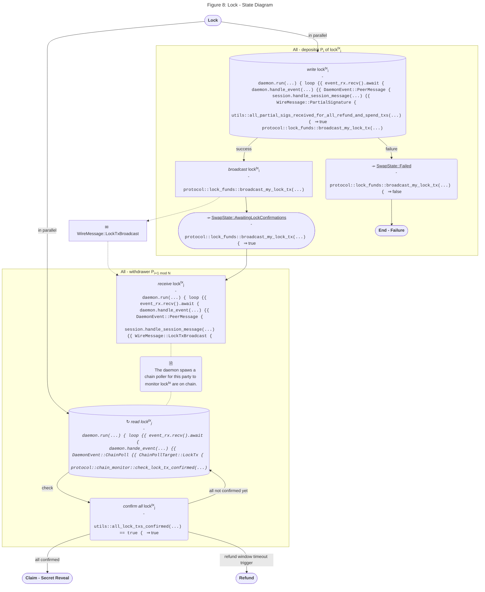

---

## 5.3.5 Claim Phase

### Secret Reveal

**Goal:** once all lock transactions are confirmed on-chain,
non-leader parties immediately broadcast their adaptor secrets and begin watching for the trigger;
the leader waits to collect those secrets before triggering.

**Pre-condition:** the daemon's `ChainPollTarget::LockTx` pollers have confirmed all N lock transactions
(`all_lock_txs_confirmed` returns `true`).

The behaviour diverges by role at this point:

**Non-leader Pi ≠ leader:**

1. Transition to `AwaitingLeaderSpend`.
2. Broadcast `SecretReveal(tj)` (hex-encoded scalar) to all other parties.
3. The daemon spawns a `ChainPollTarget::LeaderSpendTx` poller to watch for the trigger on-chain.

**Leader Pleader</leader>:**

1. Transition to `AwaitingSecrets`.
2. Wait for `SecretReveal` messages from the N−1 non-leaders (received via `handle_session_message`).

On receiving `SecretReveal(tj)` from participant j (any party):

1. Store tj in `adaptor_secrets`.
2. If `all_adaptor_secrets_received` is true (leader only — see below), proceed to the Claim phase.

> **Critical constraint:** the leader must **never** share tleader off-chain.
> Pleader's adaptor secret is disclosed *only* through the on-chain broadcast of the trigger spend tx.
> Were Pleader to share tleader off-chain,
> the remaining N−1 parties could reconstruct tagg independently
> and time the trigger broadcast to expire just before Pleader's refund window Wleader,
> cheating Pleader.

> **Note on `all_adaptor_secrets_received`:** this condition becomes true only for the *leader*,
> because the leader holds its own tleader from initialisation
> and receives tj from every non-leader via `SecretReveal`.
> Non-leaders never reach this condition via peer messages (since the leader never broadcasts its secret);
> instead, they recover tagg directly from the on-chain trigger signature.

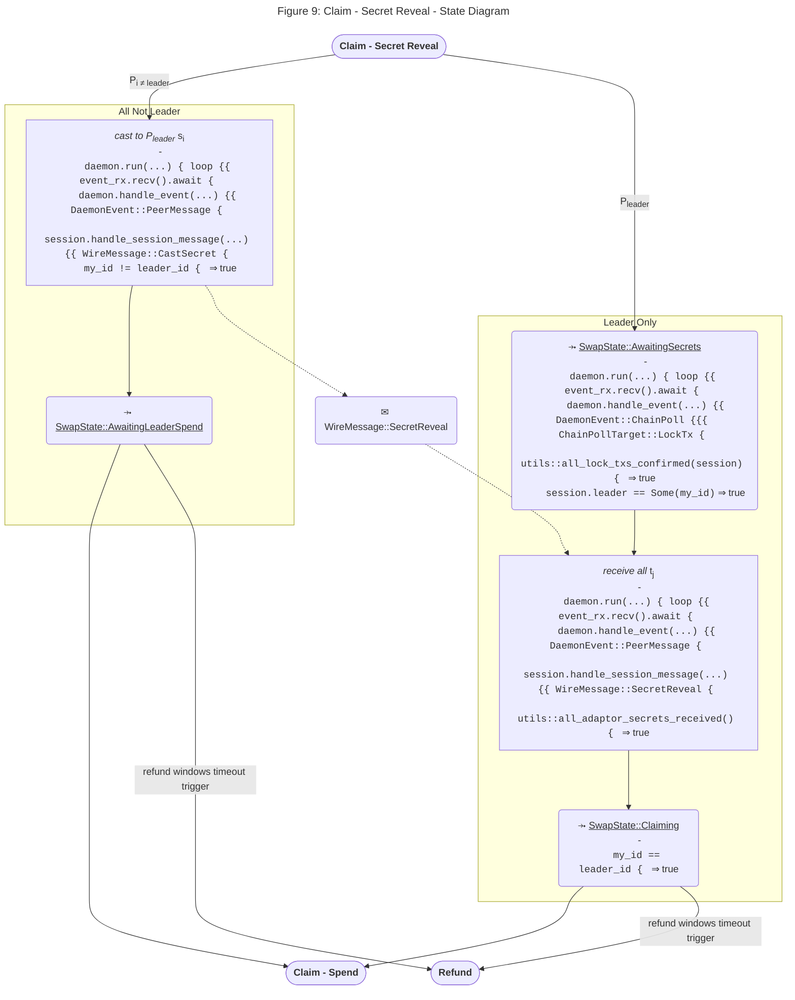

### Spend Transaction

**Goal:** every party claims the funds locked for the transfer it is receiving.

#### Leader's Role (Pleader)

**Post-condition:** trigger tx on-chain; tagg publicly extractable from its Schnorr signature.

#### Non-Leader Roles (Pi ≠ leader)

Non-leaders are in `AwaitingLeaderSpend`, with the daemon polling `ChainPollTarget::LeaderSpendTx`.

On `check_leader_spend_confirmed` returning `true`, `extract_secret_and_adapt` is called:

> **Deviation — trigger never arrives:** if the daemon's `ChainPollTarget::RefundWindow`
> fires (slot/block ≥ Wj) before the trigger is observed, P_j falls through to the Refund phase.

**Post-condition (happy path):** all N spend txs broadcast; each party has claimed their output.
State = `Completed`.

```mermaid
---
title: "Figure 10: Claim - Spend - State Diagram"
---
flowchart TD
    claim_spend(["
        <b>Claim - Spend</b>
    "])

    %%  Leader Only
    write_spend_tx_leader[("
        <i>sign and write</i> spend<sup>tx</sup><sub>leader</sub>
        -
        <code>daemon.run(...) { loop {{ event_rx.recv().await { </code>
        <code>daemon.handle_event(...) {{ DaemonEvent::PeerMessage { </code>
        <code>session.handle_session_message(...) {{ WireMessage::SecretReveal { </code>
        <code>all_adaptor_secrets_received(...) { </code> ⇒ true
        <code>my_id == leader_id{ </code> ⇒ true
        <code>protocol:spend::broadcast_my_spend_tx(...)</code>
    ")]
    broadcast_spend_tx_leader["
        <i>broadcast</i> spend<sup>tx</sup><sub>leader</sub>
        -
        <code>protocol:spend::broadcast_my_spend_tx(...)</code>
    "]
    wire_message_spend_tx_broadcast_leader("
        ✉ WireMessage::SpendTxBroadcast
    ")
    swap_state_completed_leader(["
        ⤞ <u>SwapState::Completed</u>
    "])
    refund_leader([
        <b>Refund</b>
    ])
    success_leader(["
        <b>End - Success</b>
    "])
    
    %%  All Not Leader
    receive_spend_tx_leader["
        <i>receive</i> spend<sup>tx</sup><sub>leader</sub>
        -
        <code>daemon.run(...) { loop {{ event_rx.recv().await { </code>
        <code>daemon.handle_event(...) {{ DaemonEvent::PeerMessage { </code>
        <code>session.handle_session_message(...) {{ match WireMessage::SpendTxBroadcast { </code>
    "]
    receive_spend_tx_leader_note("
        🗎
        The daemon spaws a chain poller for this party to monitor lock<sup>tx</sup> are on chain.
    ")
    read_spend_tx_leader[("
        ↻ <i>read<i/> spend<sup>tx</sup><sub>leader</sub>
        -
        <code>daemon.run(...) { loop {{ event_rx.recv().await { </code>
        <code>daemon.handle_event(...) {{ DaemonEvent::ChainPoll {{{ ChainPollTarget::LeaderSpendTx { </code>
        <code>protocol::chain_monitor::check_leader_spend_confirmed(...)</code>
    ")]
    read_leader_spend_tx_confirmed["
        <i>confirm<i/> spend<sup>tx</sup><sub>leader</sub>
        -
        <code>protocol::chain_monitor::check_leader_spend_confirmed(...) { </code> ⇒ true
    "]
    write_spend_tx[("
        <i>sign and write<i/> spend<sup>tx</sup><sub>i</sub>
        -
        <code>protocol::secret::extract_secret_and_adapt(...) { ⇒ true</code>
        <code>broadcast_my_spend_tx(...)</code>
    ")]
    swap_state_claiming(["
        ⤞ <u>SwapState::Claiming</u>
        -
        <code>protocol::secret::extract_secret_and_adapt(...) { </code> ⇒ true
    "])
    broadcast_spend_tx["
        <i>broadcast<i/> spend<sup>tx</sup><sub>i</sub>
        -
        <code>protocol::spend::broadcast_my_spend_tx(...)</code>
    "]
    swap_state_completed(["
        ⤞ <u>SwapState::Completed</u>
    "])
    refund([
        <b>Refund</b>
    ])
    success(["
        <b>End - Success</b>
    "])
    
    %%  All
    receive_spend_tx["
        <i>receive</i> spend<sup>tx</sup><sub>j</sub>
        -
        <code>daemon.run(...) { loop {{ event_rx.recv().await { </code>
        <code>daemon.handle_event(...) {{ DaemonEvent::PeerMessage { </code>
        <code>session.handle_session_message(...) {{ WireMessage::SpendTxBroadcast { </code>
    "]
    receive_spend_tx_note("
        🗎
        Log
    ")
    
    
    wire_message_spend_tx_broadcast("
        ✉ WireMessage::SpendTxBroadcast
    ")
    
    
    claim_spend -- P<sub>leader</sub> --> write_spend_tx_leader
    claim_spend -- P<sub>i ≠ leader</sub> --> receive_spend_tx_leader
    wire_message_spend_tx_broadcast_leader -.-> receive_spend_tx_leader
    subgraph All Not Leader
        receive_spend_tx_leader -.- receive_spend_tx_leader_note
        receive_spend_tx_leader_note -.- read_spend_tx_leader
        read_leader_spend_tx_confirmed -- not yet confirmed --> read_spend_tx_leader
        read_spend_tx_leader -- check --> read_leader_spend_tx_confirmed
        read_leader_spend_tx_confirmed -- success --> swap_state_claiming
        swap_state_claiming -- success --> write_spend_tx
        broadcast_spend_tx --> swap_state_completed
        write_spend_tx --> broadcast_spend_tx
    end
    read_leader_spend_tx_confirmed -- failure<br>refund windows timeout trigger --> refund
    write_spend_tx -- failure<br>refund windows timeout trigger --> refund
    broadcast_spend_tx -.-> wire_message_spend_tx_broadcast
    wire_message_spend_tx_broadcast -.-> receive_spend_tx
    swap_state_completed --> success
    success -- interrupt --> refund
    subgraph All
        receive_spend_tx -.- receive_spend_tx_note
    end
    subgraph Leader Only
        write_spend_tx_leader --> broadcast_spend_tx_leader
        broadcast_spend_tx_leader --> swap_state_completed_leader
    end
    broadcast_spend_tx_leader -.-> wire_message_spend_tx_broadcast_leader
    swap_state_completed_leader --> success_leader
    success_leader -- interrupt --> refund_leader
```

---

## 5.3.6. Refund Phase

**Goal:** any party whose refund window has opened and whose locked funds have not yet been claimed reclaims their
deposit.

This phase is triggered by `ChainPollTarget::RefundWindow` whenever the current block height
or slot exceeds Wi and the session is not in a terminal state.

**Pre-condition for Pi<.sub> to broadcast their refundtx:**

- Bitcoin: block height ≥ Wi(BTC).
- Cardano: current slot **>** Wi(ADA) (strict — see [Refund Windows](5_bbw.md#525-refund-windows)).
- Session state is not `Completed`, `Refunded`, or `Failed`.

**Action:** `broadcast_my_refund_tx` submits the fully co-signed refund tx:

- **Bitcoin:** submit the pre-assembled MuSig2-signed tx directly via `submit_bitcoin_tx`.
- **Cardano:** if a collateral UTxO is registered in `cardano_collaterals`,
- attach the Ed25519 collateral witness via `add_collateral_witness` before submitting.

On success the session transitions to `Refunded`; on failure to `Failed`.
All active pollers are cancelled.

**Liveness obligation:** the daemon's `ChainPollTarget::RefundWindow` poller is spawned
as soon as the party's own lock tx is confirmed (`confirmed_lock_txs.contains(&my_id)`)
and runs continuously until the session reaches a terminal state.

**Post-condition:** Pi's deposit is returned.
State = `Refunded`.
No party has lost their principal.

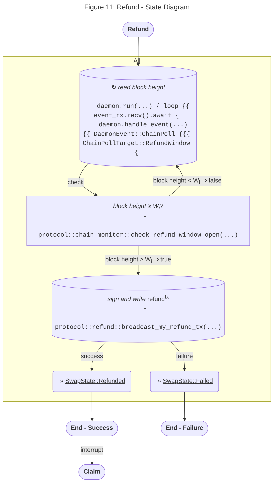
---

