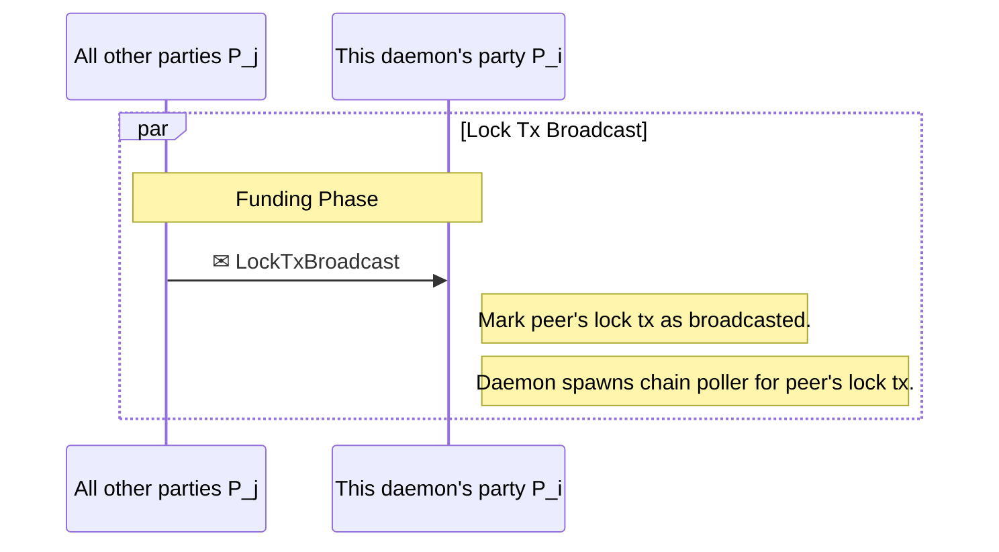
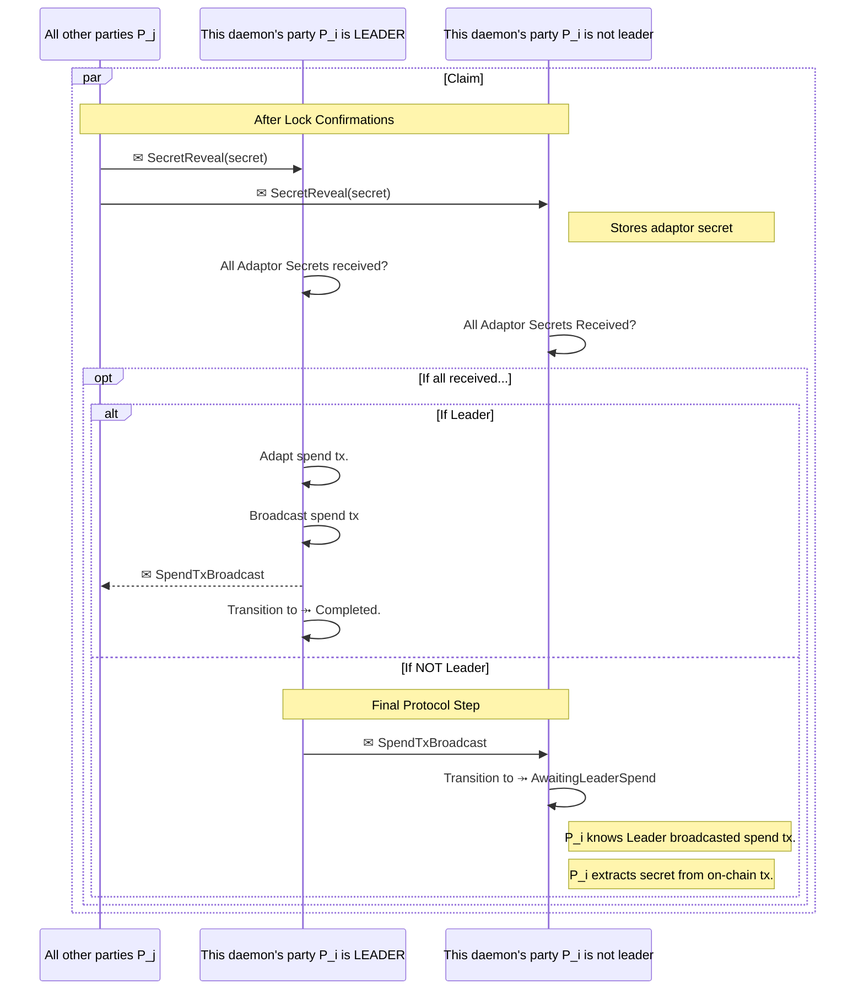

# 6. Runtime View

## 6.1 Daemon

The [`types::Daemon`](../../swap-daemon/src/daemon.rs) is the software actor managing the
swap session on behalf of the party. 
There is one `Daemon` instance per party.

All daemons cooperate to lead the protocol evolution from one phase to the next one,
sending [`WireMessage`](../../swap-daemon/src/types.rs) to the other daemons off the chain
and polling for [`ChainPollTarget`]() events on the chain.

Each daemon assumes a _role_ according to the transaction it commits to the chain.

- deposit: locktx is committed with the default no-role.
- refund: refundtx is committed with `TxRole::Refund`
- withdraw: spendtx is committed with `Tx::Spend`

Each daemon describes the party it represents and the other parties with the
([`types::Participant`](../../swap-daemon/src/types.rs)) type.

```mermaid
flowchart TD
%% ============================================================
%% Lifecycle / bootstrap
%% ============================================================
    new["Daemon::new(swap_keys, config)"]
    insert_session["daemon.insert_session(session)"]
    start_swap_session["daemon.start_swap_session(session_id)"]
    run["daemon.run()"]

    new --> insert_session --> start_swap_session --> run

    %% Two concurrent tokio tasks spawned by run()
    run -- "tokio::spawn (accept loop)" --> NET
    run -- "tokio::spawn (event loop)" --> EVENT

  %% ============================================================
  %% Networking subgraph: TCP accept + connection handling
  %% ============================================================
    subgraph NET["Networking task"]
      listener_accept --> listener_accept
      listener_accept -- "tokio::spawn" --> handle_connection
      
      listener_accept["listener.accept()"]
      handle_connection["networking::handle_connection(...)"]
    end

    handle_connection -.-> DaemonEvent::PeerMessage 
    DaemonEvent::PeerMessage("✉ DaemonEvent::PeerMessage")

    event_rx_recv --> handle_event
    DaemonEvent::PeerMessage -.-> event_rx_recv
%%    handle_event -.-> listener_accept

    %% ============================================================
    %% Event Channel: mpsc channel connecting tasks
    %% ============================================================
    subgraph EVENT["Event handling task"]
      event_rx_recv["event_rx_recv()"]
      handle_event["daemon.handle_event(event, event_tx)"]
      match_event{?}

      handle_event --> match_event 
      match_event -- ✉ DaemonEvent::PeerMessage --> handle_session_message
      match_event -- ↻ DaemonEvent::ChainPoll --> poll_match_target
      
      subgraph MESSAGE["Message handling"]
        handle_session_message --> peer_match_target
        handle_session_message["session.handle_session_message(wire_message, partecipant_id, keys, config)"]
        peer_match_target{?}
        
        peer_match_target -- ✉ WireMessage::AdaptorPoint --> AdaptorPoint--> all_adaptor_points_received --> SwapState::AwaitingLeaderElectionCommitments --> start_leader_election
        AdaptorPoint["WireMessage::AdaptorPoint(point)"]
        all_adaptor_points_received["session.all_adaptor_points_received() ∧ <br>SwapState::AwaitingAdaptorPoints ⇒ true"]
        SwapState::AwaitingLeaderElectionCommitments>"SwapState::AwaitingLeaderElectionCommitments"]
        start_leader_election[["leader_election::start_leader_election(session)"]]
        
        peer_match_target -- ✉ WireMessage::LeaderElectionCommitment --> LeaderElectionCommitment -- "leader commitment received before starting election?" --> is_electing
        LeaderElectionCommitment["WireMessage::LeaderElectionCommitment(commitment)"]
        is_electing -- true --> SwapState::AwaitingLeaderElectionCommitments
        is_electing --> received_leader_commitment --> all_leader_commitments_received --> broadcast_leader_nonce
        broadcast_leader_nonce --> SwapState::AwaitingLeaderElectionNonces
        is_electing{?}
        received_leader_commitment["leader_election::received_leader_commitment(session, commitment, participant_id)"]
        all_leader_commitments_received["session.all_leader_commitments_received() ∧ <br>SwapState::AwaitingLeaderElectionCommitments ⇒ true"]
        broadcast_leader_nonce[["leader_election::broadcast_leader_nonce(session, nonce)"]]
        SwapState::AwaitingLeaderElectionNonces>"SwapState::AwaitingLeaderElectionNonces"]
              
        peer_match_target -- ✉ WireMessage::LeaderElectionNonce --> LeaderElectionNonce --> received_leader_nonce --> all_leader_nonces_received --> compute_leader --> SwapState::RefundAndSpendTxsSigning --> build_lock_txs --> begin_refund_signing --> begin_spend_signing
        LeaderElectionNonce["WireMessage::LeaderElectionNonce(nonce)"]
        all_leader_nonces_received["utils::all_leader_nonces_received(session) ∧ <br>session.self.musig_sessions.is_empty() ⇒ true"]
        compute_leader[["protocol::leader_election::compute_leader(session)"]]
        SwapState::RefundAndSpendTxsSigning>"SwapState::RefundAndSpendTxsSigning"]
        build_lock_txs[["protocol::lock_funds::build_lock_txs(session, config)"]]
        begin_refund_signing[["protocol::refund::begin_refund_signing(session, keys)"]]
        begin_spend_signing[["protocol::spend::begin_spend_signing(session, keys)"]]
        
        peer_match_target -- ✉ WireMessage::SchnorrNonce --> SchnorrNonce --> all_schnorr_nonces_received_for -->  transition_to_round_two --> MusigRuntime::RoundTwo
        SchnorrNonce["WireMessage::SchnorrNonce(role, nonce)"]
        all_schnorr_nonces_received_for["utils::all_schnorr_nonces_received_for(session, role) ⇒ true"]
        transition_to_round_two[["cryptography::multisig::transition_to_round_two(session, keys, role)"]]
        MusigRuntime::RoundTwo>"MusigRuntime::RoundTwo"]
        
        peer_match_target -- ✉ WireMessage::PartialSignature --> PartialSignature --> all_partial_sigs_received_for --> is_all_partial_sigs_received_for
        is_all_partial_sigs_received_for -- true --> finalize_role
        finalize_role --> all_partial_sigs_received_for_all_refund_and_spend_txs
        is_all_partial_sigs_received_for -- false --> all_partial_sigs_received_for_all_refund_and_spend_txs --> broadcast_my_lock_tx --> is_broadcast_my_lock_tx
        is_broadcast_my_lock_tx -- success --> SwapState::AwaitingLockConfirmations
        is_broadcast_my_lock_tx -- fail --> MESSAGE_SwapState::Failed
        PartialSignature["WireMessage::PartialSignature(role, sig)"]
        all_partial_sigs_received_for["utils::all_partial_sigs_received_for(session, role)"]
        is_all_partial_sigs_received_for{?}
        finalize_role[["cryptography::multisig::finalize_role(session, keys, role, config)"]]
        all_partial_sigs_received_for_all_refund_and_spend_txs[["utils::all_partial_sigs_received_for_all_refund_and_spend_txs(session) ⇒ true"]]
        broadcast_my_lock_tx[["protocol::lock_funds::broadcast_my_lock_tx(session, keys, config)"]]
        is_broadcast_my_lock_tx{?}
        SwapState::AwaitingLockConfirmations>"SwapState::AwaitingLockConfirmations"]
        MESSAGE_SwapState::Failed>"SwapState::Failed"]
        
        peer_match_target -- ✉ WireMessage::LockTxBroadcast --> LockTxBroadcast --> note_for_LockTxBroadcast
        LockTxBroadcast["WireMessage::LockTxBroadcast{...}"]
        note_for_LockTxBroadcast("🗎<br>Spawn a chain poller for this party's lock<sup>tx</sup>")
        
        peer_match_target -- ✉ WireMessage::SecretReveal --> SecretReveal --> all_adaptor_secrets_received
        all_adaptor_secrets_received --> MESSAGE_is_leader
        MESSAGE_is_leader -- "P<sub>i≠leader</sub>" --> MESSAGE_SwapState::AwaitingLeaderSpend
        MESSAGE_is_leader -- "P<sub>leader</sub>" --> SwapState::Claiming --> MESSAGE_broadcast_my_spend_tx --> MESSAGE_SwapState::Completed
        SecretReveal["WireMessage::SecretReveal(secret)"]
        all_adaptor_secrets_received["utils::all_adaptor_secrets_received(session) ⇒ true"]
        MESSAGE_SwapState::AwaitingLeaderSpend>"SwapState::AwaitingLeaderSpend"]
        SwapState::Claiming>"SwapState::Claiming"]
        MESSAGE_broadcast_my_spend_tx[("protocol::spend_funds::broadcast_my_spend_tx(session, keys, config)")]
        MESSAGE_SwapState::Completed>"SwapState::Completed"]
        
        peer_match_target -- ✉ WireMessage::SpendTxBroadcast --> SpendTxBroadcast --> note_for_SpendTxBroadcast
        SpendTxBroadcast["WireMessage::SpendTxBroadcast"]
        note_for_SpendTxBroadcast("🗎<br>Log")
      end
      
      subgraph CHAIN_POLL["Chain polling"]
        poll_match_target -- "ChainPollTarget::LockTx" --> LockTx  --> all_lock_txs_confirmed --> CHAIN_POLL_is_leader
        CHAIN_POLL_is_leader{?} -- "P<sub>i≠leader</sub>" --> CHAIN_POLL_SwapState::AwaitingLeaderSpend -- trigger --> maybe_spawn_pollers
        CHAIN_POLL_is_leader -- "P<sub>leader</sub>" --> SwapState::AwaitingSecrets --> maybe_spawn_pollers
        LockTx("ChainPollTarget::LockTx { partertecipant_id }")
        all_lock_txs_confirmed["utils::all_lock_txs_confirmed(session) ⇒ true"]
        CHAIN_POLL_SwapState::AwaitingLeaderSpend>"SwapState::AwaitingLeaderSpend"]
        SwapState::AwaitingSecrets>"SwapState::AwaitingSecrets"]
        
        poll_match_target -- "ChainPollTarget::LeaderSpendTx" --> LeaderSpendTx --> check_leader_spend_confirmed --> extract_secret_and_adapt -- "P<sub>leader<</sub>'s spend<sup>tx</sup> on chain?" --> is_extract_secret_and_adapt
        is_extract_secret_and_adapt -- true --> CHAIN_POLL_SwapState::Claiming --> CHAIN_POLL_broadcast_my_spend_tx --> CHAIN_POLL_SwapState::Completed --> maybe_spawn_pollers
        is_extract_secret_and_adapt -- false --> maybe_spawn_pollers
        LeaderSpendTx("ChainPollTarget::LeaderSpendTx { leader_id } ")
        check_leader_spend_confirmed["protocol::chain_monitor::check_leader_spend_confirmed(session, leader_id, config) ⇒ true"]
        extract_secret_and_adapt[["extract_secret_and_adapt(session, leader_id, config)"]]
        is_extract_secret_and_adapt{?}
        CHAIN_POLL_SwapState::Claiming>"CHAIN_POLL_SwapState::Claiming"]
        CHAIN_POLL_broadcast_my_spend_tx[("protocol::spend_funds::broadcast_my_spend_tx(session, keys, config)")]
        CHAIN_POLL_SwapState::Completed>"SwapState::Completed"]
        
        poll_match_target -- "ChainPollTarget::RefundWindow" --> RefundWindow -- "SwapState::Completed<br>⋁ SwapState::Refunded<br> ⋁ SwapState::Failed" --> is_done
        is_done -- false --> check_refund_window_open --> broadcast_my_refund_tx --> is_broadcast_my_refund_tx
        is_broadcast_my_refund_tx -- success --> SwapState::Refunded --> cancel_session_pollers
        is_broadcast_my_refund_tx -- failure --> CHAIN_POLL_SwapState::Failed --> cancel_session_pollers
        cancel_session_pollers -- interrupt --> maybe_spawn_pollers
        RefundWindow("ChainPollTarget::RefundWindow { participant_id }")
        is_done{?}
        check_refund_window_open[("protocol::chain_monitor::check_refund_window_open(session, participant_id, config) ⇒ true")]
        broadcast_my_refund_tx[("protocol::spend_funds::broadcast_my_refund_tx(session, keys, config)")]
        is_broadcast_my_refund_tx{?}
        SwapState::Refunded>"SwapState::Refunded"]
        CHAIN_POLL_SwapState::Failed>"SwapState::Failed"]
        cancel_session_pollers["daemon.cancel_session_pollers(session_id)"]
        
        
        poll_match_target{?}
        maybe_spawn_pollers[["daemon.maybe_spawn_pollers(session_id, event_tx)"]]
      end
    end
    
    start_leader_election -.-> WireMessage::LeaderElectionCommitment --> x     
    WireMessage::LeaderElectionCommitment("✉ WireMessage::LeaderElectionCommitment")
    SwapState::AwaitingLeaderElectionNonces -.-> WireMessage::LeaderElectionNonce --> x
    WireMessage::LeaderElectionNonce("✉ WireMessage::LeaderElectionNonce")
    MusigRuntime::RoundTwo -.-> WireMessage::PartialSignature --> x
    WireMessage::PartialSignature("✉ WireMessage::PartialSignature")
    SwapState::AwaitingLockConfirmations -.-> WireMessage::LockTxBroadcast --> x 
    WireMessage::LockTxBroadcast("✉ WireMessage::LockTxBroadcast")
    MESSAGE_SwapState::Completed -.-> WireMessage::SpendTxBroadcast --> x
    WireMessage::SpendTxBroadcast("✉  WireMessage::SpendTxBroadcast)")
    CHAIN_POLL_SwapState::AwaitingLeaderSpend -.-> WireMessage::SecretReveal
    WireMessage::SecretReveal("✉  WireMessage::SecretReveal") --> x

%%  handle_session_message -.-  DaemonEvent::PeerMessage 

```

 
---

## 6.2 Messages

The [Protocol Reference Implementation](5_bbw_protocol.md) describes phase progress through [`types::SwapState`](../../swap-daemon/src/types.rs)
because [`types::WireMessage`](../../swap-daemon/src/types.rs) exchaghed among parties off the chain through the network.

[Mermaid Sequence Diagram](https://mermaid.ai/open-source/syntax/sequenceDiagram.htm) syntax has
limited support for HTML, hence the following typographic convetions

- `P_i` is Pi, the _deamon_'s party receiving messaged from other parties and sending messages to them.
- `P_j` are j j≠i, are any of all _other deamons_' parties, sending messages to Pi
  and receving the messages Pi broadcats to them.
- `tx` means _transaction_, `txs` means _transactions_.

### 6.2.1 [Config Phase](5_bbw_protocol.md#532-config-phase)

The configuration supposes all parties have the public key of each other parties 
and agree about the swap description.
The reference implementation injects the public keys with the
[`pub fn new(swap_keys: SwapKeys, config: DaemonConfig) -> Self`](../../swap-daemon/src/daemon.rs) 
function, then the swap description is injected with the
[`pub fn insert_session(&mut self, session: SwapSession)`](../../swap-daemon/src/daemon.rs).

No messages among parties are exchanged during this phase.

### 6.2.2 [Setup Phase](5_bbw_protocol.md#533-setup-phase)

```mermaid
sequenceDiagram
%%  Adaptor Point
    participant P_j as All other parties P_j
    participant P_i as This daemon's party P_i
    par Adaptor Point Exchange
        Note over P_j, P_i: All participants exchange Adaptor Points.
        P_j->>P_i: ✉ AdaptorPoint
        Note right of P_i: Stores Adaptor point.
        P_i->>P_i: All Adaptor Points received?
        opt If all received...
            P_i->>P_i: Transition to ⤞ AwaitingLeaderElectionCommitments.
        end
    end

%%  Leader Election
    participant P_j
    participant P_i
    par Leader Commitment Exchange
        Note over P_j, P_i: Leader Election - Round 1<br>Commitment Exchange
        P_j->>P_i: ✉ LeaderElectionCommitment
        Note right of P_i: Stores Leader Commitment.
        P_i->>P_i: All Leader Commitments received?
        opt If all received...
            P_i->>P_i: Transition to ⤞ AwaitingLeaderElectionNonces.
            P_i-->>P_j: ✉ LeaderElectionNonce
        end
    end
    par Leader Nonce Exchange
        Note over P_j, P_i: Leader Election - Round 2<br>Nonce Exchange
        P_j->>P_i: ✉ LeaderElectionNonce
        Note right of P_i: Stores Leader Nonce.
        P_i->>P_i: All Leader Nonces received?
        opt If all received...
            P_i->>P_i: Compute Leader.
            P_i->>P_i: Transition to ⤞ RefundAndSpendTxsSigning.
            P_i->>P_i: Start signing refund and spend txs.
        end
    end

%%  Schnorr Nonce
    participant P_j
    participant P_i
    par Musig2 Round 1 Schnorr Nonce Exchange
        Note over P_j, P_i: Musig2 Round 1
        P_j->>P_i: ✉ SchnorrNonce(role, nonce)
        Note right of P_i: Stores nonce for role.
        P_i->>P_i: All Schnorr Nonces received for role?
        opt If all received...
            P_i->>P_i: Transition to round two for the role.
            P_i-->>P_j: ✉ PartialSignature(role, sig)
        end
    end
    
%%  Partial Signature
    participant P_j
    participant P_i
    par MuSig2 Round 2 Partial Signature Exchange
        Note over P_j, P_i: Musig2 Round 2
        P_j->>P_i: ✉ PartialSignature(role, sig)
        Note right of P_i: Stores partial signature.
        P_i->>P_i: All Partial Signatures received for the role?
        opt If all received...
            P_i->>P_i: Finalize role (finalize tx).
        end
        P_i->>P_i: All Partial Signatures Received for all txs?
        opt If all received...
            P_i->>P_i: Transition to ⤞ Funding.
            P_i->>P_i: Broadcast Lock Tx.
            P_i-->>P_j: LockTxBroadcast.
        end
    end
```
 

### 6.2.3 [Lock Phase](5_bbw_protocol.md#534-lock-phase)

### 6.2.4 [Claim Phase](5_bbw_protocol.md#535-claim-phase)

### 6.2.5 [Refund Phase](5_bbw_protocol.md#536-refund-phase)

The Refund phase runs on chain only and doesn't involve any `WireMessage` exchange off the chain.

---
