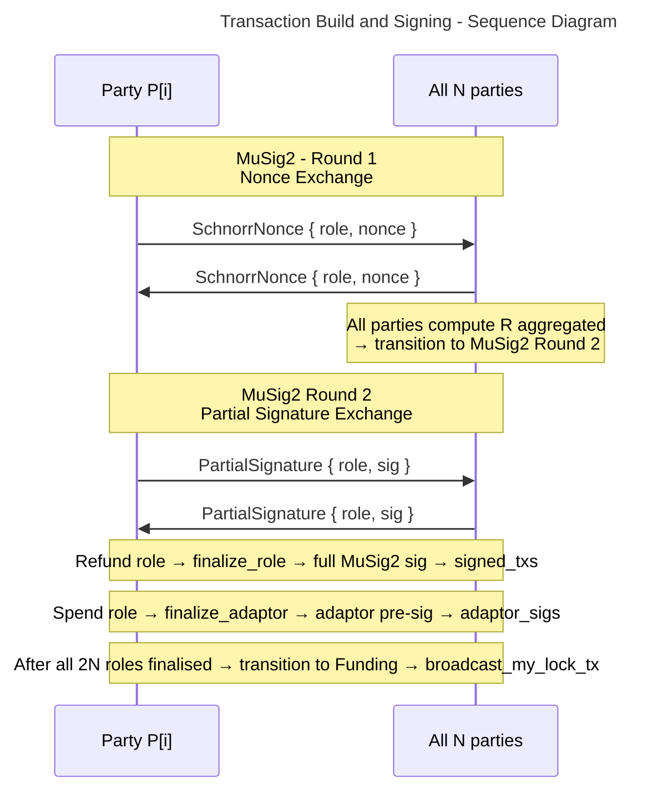

# 6. Runtime View

## 6.1 Daemon

[`types::Daemon`](../../swap-daemon/src/daemon.rs)

```mermaid
flowchart TD
    Daemon::new("
        Daemon::new(swap_keys: SwapKeys, config: DaemonConfig)
    ")
    daemon.insert_session("
        daemon.insert_session(session: SwapSession)
    ")
    daemon.start_swap_session("
        daemon.start_swap_session(session_id: u64)
    ")
    daemon.run("
        daemon.run() {
        tokio::spawn ({
        loop {
    ")
    %% Connect
    listener.accept("
        match listener.accept() {
    ")
    networking::handle_connection("
        networking::handleConnection(...)
    ")
    DaemonEvent::PeerMessage("
        ✉ DaemonEvent::PeerMessage
    ")
    %% Handle Event
    event_rx.recv("
        match event_rx.recv() {
    ")
    x
    daemon.handle_event("
        daemon.hande_event(...)
    ")
    handle_session_message("
        session.handle_session_message(...)
    ")
    ChainPollTarget::LockTx("
        session.confirmed_lock_txs.contains(&participant_id) ⇒ false
        utils::all_lock_txs_confirmed(session: SwapSession) ⇒ true
    ")
    SwapState::AwaitingLeaderSpend(["
        ⤞ <u>SwapState::AwaitingLeaderSpend
    "])
    SwapState::AwaitingSecrets(["
        ⤞ <u>SwapState::AwaitingSecrets</u>
    "])
    WireMessage::SecretReveal("
        ✉ WireMessage::SecretReveal
    ")
    ChainPollTarget::LeaderSpendTx("
        protocol::chain_monitor::check_leader_spend_confirmed(...) ⇒ true
        protocol::secret::extract_secret_and_adapt(...) ⇒ true
    ")
    SwapState::Claiming(["
        ⤞ <u>SwapState::Claiming</u>
    "])
    ChainPollTarget::RefundWindow("
        session.state == SwapState::Completed | SwapState::Refunded | SwapState::Failed ⇒ false
        protocol::chain_monitor::check_refund_window_open(...) ⇒ true
    ")
    SwapState::Refunded(["
        <u>SwapState::Refunded</u>
    "])
    broadcast_my_refund_tx[("
        protocol::refund::broadcast_my_refund_tx(...)
    ")]
    daemon.cancel_session_pollers("
        daemon.cancel_session_pollers(...)
    ")
    daemon.maybe_spawn_pollers("
        daemon.maybe_spawn_pollers(...)
    ")
    broadcast_my_spend_tx[("
        spend::broadcast_my_spend_tx(...)
    ")]
    SwapState::Completed(["
        ⤞ <u>SwapState::Completed</u>
    "])
    daemon.spawn_poller("
        daemon.spawn_poller(...)
    ")
    AdaptorPoint("
        utilis::all_adaptor_points_received ⇒ true
        SwapState::AwaitingAdaptorPoints ⇒ true
    ")
    SwapState::AwaitingLeaderElectionCommitments(["
        ⤞ <u>SwapState::AwaitingLeaderElectionCommitments</u>
    "])
    start_leader_election("
        leader_election::start_leader_election(...)
    ")
    LeaderElectionCommitment("
        leader_election::received_leader_commitment(...)
        leader_election::all_leader_commitments_received(...) ⇒ true
        SwapState::AwaitingLeaderElectionNonces ⇒ true
        
    ")
    LeaderElectionNonce("
        leader_election::received_leader_nonce(...)
        all_leader_nonces_received(...) ⇒ true
    ")
    compute_leader("
        leader_election::compute_leader(...)
    ")
    SwapState::RefundAndSpendTxsSigning(["
        ⤞ <u>SwapState::RefundAndSpendTxsSigning</u>
    "])
    build_lock_txs("
        protocol::lock_funds::build_lock_txs(...)
    ")
    begin_refund_signing("
        protocol::refund::begin_refund_signing(...)
    ")
    begin_spend_signing("
        protocol::spend::begin_spend_signing(...)
    ")
    SchnorrNonce("
        utils::all_schnorr_nonces_received_for(...) ⇒ true
    ")
    transition_to_round_two("
        cryptography::multisig::transition_to_round_two(...)
    ")
    PartialSignature("
        utils::all_partial_sigs_received_for(...) ⇒ true
    ")
    finalize_role("
        cryptography::multisig::finalize_role(...)
    ")
    all_partial_sigs_received_for_all_refund_and_spend_txs("
        utils::all_partial_sigs_received_for_all_refund_and_spend_txs(...) ⇒ true
    ")
    broadcast_my_lock_tx[("
        protocol::lock_funds::broadcast_my_lock_tx(...)
    ")]
    broadcast_my_spend_tx[("
        protocol::spend::broadcast_my_spend_tx(...)
    ")]
    LockTxBroadcast("
        <i>poll blockchain</i>
    ")
    SecretReveal("
        utils::all_adaptor_secrets_received(...) ⇒ true
    ")
    broadcast_my_spend_tx[("
        protocol::spend::broadcast_my_spend_tx(...)
    ")]
    SpendTxBroadcast("
        <i>log event</i>
    ")
    
    Daemon::new --> daemon.insert_session
    daemon.insert_session --> daemon.start_swap_session
    daemon.start_swap_session --> daemon.run
    daemon.run -- spawn --> listener.accept
    daemon.run -- spawn --> event_rx.recv
    %% subgraph network connect
        listener.accept --> listener.accept
        listener.accept -- spawn --> networking::handle_connection
    %% end
    networking::handle_connection -.-> DaemonEvent::PeerMessage
    DaemonEvent::PeerMessage -.-> event_rx.recv 
    %% subgraph "event receive"     
        event_rx.recv --> daemon.handle_event
        daemon.handle_event -- DaemonEvent::PeerMessage --> handle_session_message
        daemon.handle_event -- ChainPollTarget::LockTx --> ChainPollTarget::LockTx
        daemon.handle_event -- ChainPollTarget::LeaderSpendTx --> ChainPollTarget::LeaderSpendTx
        daemon.handle_event -- ChainPollTarget::RefundWindow --> ChainPollTarget::RefundWindow
        %% subgraph "PeerMessage"         
            handle_session_message -- WireMessage::AdaptorPoint --> AdaptorPoint
            AdaptorPoint --> SwapState::AwaitingLeaderElectionCommitments
            SwapState::AwaitingLeaderElectionCommitments --> start_leader_election
            handle_session_message -- WireMessage::LeaderElectionCommitment --> LeaderElectionCommitment
            LeaderElectionCommitment --> SwapState::AwaitingLeaderElectionNonces
            handle_session_message -- WireMessage::LeaderElectionNonce --> LeaderElectionNonce
            LeaderElectionNonce --> compute_leader
            compute_leader --> SwapState::RefundAndSpendTxsSigning
            SwapState::RefundAndSpendTxsSigning --> build_lock_txs
            build_lock_txs --> begin_refund_signing
            begin_refund_signing --> begin_spend_signing
            handle_session_message -- WireMessage::SchnorrNonce --> SchnorrNonce
            SchnorrNonce --> transition_to_round_two
            handle_session_message -- WireMessage::PartialSignature --> PartialSignature
            PartialSignature --> finalize_role
            finalize_role --> all_partial_sigs_received_for_all_refund_and_spend_txs
            all_partial_sigs_received_for_all_refund_and_spend_txs --> SwapState::Funding
            SwapState::Funding --> broadcast_my_lock_tx
            handle_session_message -- WireMessage::LockTxBroadcast --> LockTxBroadcast
            handle_session_message -- WireMessage::SecretReveal --> SecretReveal
            SecretReveal -- "P<sub>i≠leader</sub>" --> SwapState::AwaitingLeaderSpend
            SecretReveal -- "P<sub>leader</sub>"--> SwapState::Claiming
            SwapState::Claiming --> broadcast_my_spend_tx
            broadcast_my_spend_tx --> SwapState::Completed
            
            handle_session_message -- WireMessage::SpendTxBroadcast --> SpendTxBroadcast
        %% end
        %% subgraph "ChainPoll"         
            ChainPollTarget::LockTx -- P<sub>leader</sub> --> SwapState::AwaitingSecrets
            ChainPollTarget::LockTx -- P<sub>i≠leader</sub> --> SwapState::AwaitingLeaderSpend
            ChainPollTarget::LeaderSpendTx --> SwapState::Claiming
            SwapState::Claiming --> broadcast_my_spend_tx
            broadcast_my_spend_tx --> SwapState::Completed
            ChainPollTarget::RefundWindow --> broadcast_my_refund_tx
            broadcast_my_refund_tx --> SwapState::Refunded
            SwapState::AwaitingSecrets --> daemon.maybe_spawn_pollers
            SwapState::AwaitingLeaderSpend -- activate --> daemon.maybe_spawn_pollers
            ChainPollTarget::LeaderSpendTx --> daemon.maybe_spawn_pollers
            ChainPollTarget::RefundWindow --> daemon.maybe_spawn_pollers
            SwapState::Completed --> daemon.cancel_session_pollers
            SwapState::Refunded --> daemon.cancel_session_pollers
        %% end
   %% end
   daemon.cancel_session_pollers -- interrupt --> daemon.spawn_poller
   daemon.maybe_spawn_pollers -- spawn --> daemon.spawn_poller
    
   start_leader_election -.-> WireMessage::LeaderElectionCommitment -.-> DaemonEvent::PeerMessage
   SwapState::AwaitingLeaderElectionNonces -.-> WireMessage::LeaderElectionNonce -.-> DaemonEvent::PeerMessage
   transition_to_round_two -.-> WireMessage::PartialSignature -.-> DaemonEvent::PeerMessage
   broadcast_my_lock_tx -.-> WireMessage::LockTxBroadcast -.-> DaemonEvent::PeerMessage
   broadcast_my_spend_tx --> WireMessage::SpendTxBroadcast -.-> DaemonEvent::PeerMessage
   SwapState::AwaitingLeaderSpend -.-> WireMessage::SecretReveal -.-> DaemonEvent::PeerMessage

   LockTxBroadcast -.- daemon.spawn_poller

    %% subgraph "event poller"
        daemon.spawn_poller
    %% end
    
    
    
    
    
    
    
    
%%        handle_session_message -- "SwapState::Completed<br>SwapState::Refunded<br>SwapState::Failed" --> daemon.cancel_session_pollers
%%        handle_session_message -- "not<br>SwapState::Completed<br>SwapState::Refunded<br>SwapState::Failed"--> daemon.maybe_spawn_pollers
    
    

```

    
---

This phase runs concurrently for all N refund roles and all N spend roles (2N `TxRole` instances).
The sub-protocol for each role is a standard two-round MuSig2 exchange:

> This exchange runs **2N** times in total: N `TxRole::Refund` instances and N `TxRole::Spend` instances.
> Every party participates in every role.
