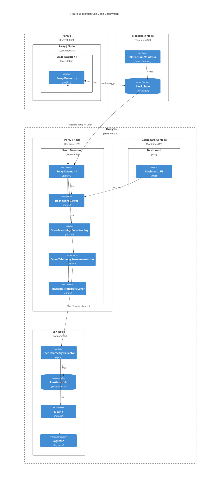
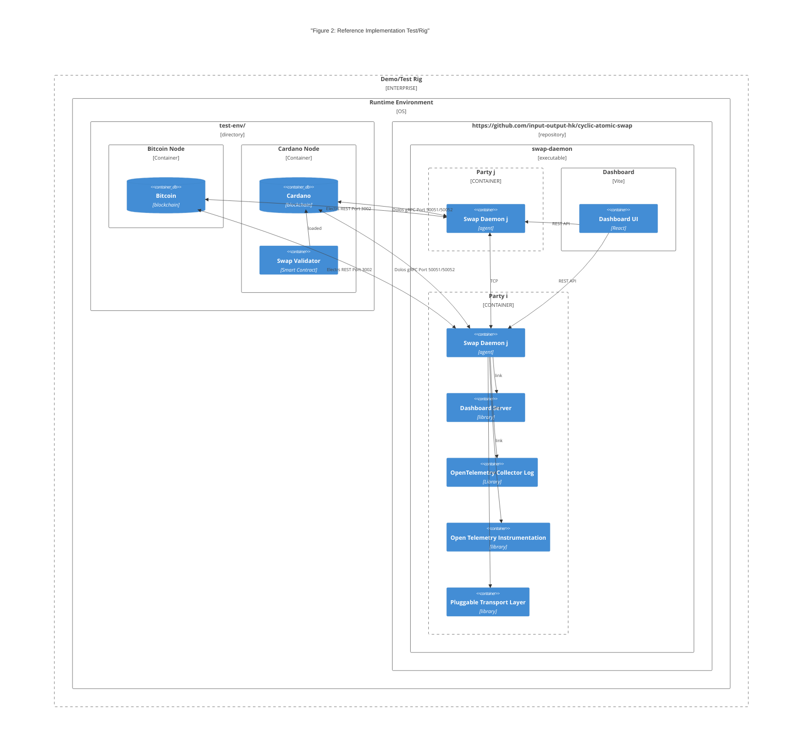

# 7. Deployment View

## 7.1 Intended Use Case

In this section 

- The index **i** identifies _this party_ the daemon represents;
- The index **j** identifies _the other parties_ this daemon interacts with.

[C4](https://c4model.com/) **enterprise boundary** means the boundary of a legal body.

The intended use case suggests

- one _enterprise boundry_ per party, encompassing
  - the daemon deployment node,
  - the optional [ELK Stack](https://www.elastic.co/elastic-stack) node,
  - the optional UI Dashboard node;
- one _enterprise boundry_ per blockchain infrastructure

Deployment nodes run in OS, on cloud, on container or on premises Operating System.

Inside the same enterprise boundary, daemons, ELK stack and UI Dashboard may or may not share the same
OS or container.

## 7.2 Reference Implementation Demo/Test Rig

The reference implementation includes a demo/test rig running all daemons in the same deployment node 
and running two containers, one for Bitcoin and one for Cardano.

The containers for Bitcoin and Cardano are published in the 
[test-env/](../../test-env) directory of this repository, so the regression suite it drives needs
no other repository. See [test-env/README.md](../../test-env/README.md) for how to run it, and
[swap-daemon/README.md](../../swap-daemon/README.md#regression-tests) for the tests themselves.

