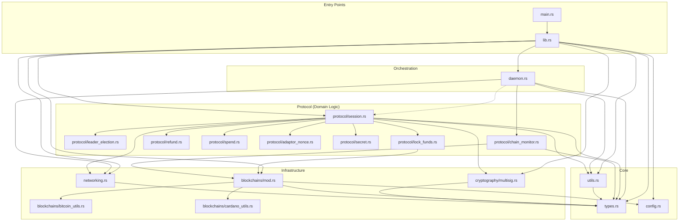
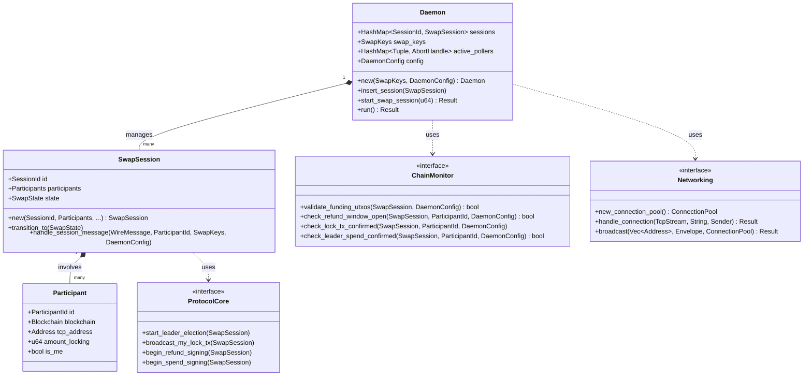

I have explored the `swap-daemon/src` directory and analyzed the top-level structure, identifying key modules and their dependencies. I need to further examine the `protocol` submodules to understand their specific roles and dependencies to create a detailed Mermaid graph.

I have analyzed the `swap-daemon/src` Rust source files and their dependencies.

Key findings:
- `lib.rs` is the central library entry point.
- `main.rs` is the binary entry point.
- `daemon.rs` handles the main execution loop and event orchestration.
- `types.rs` contains the shared data structures used across the project.
- `protocol/` submodules implement the swap protocol phases, with `session.rs` acting as the central state machine.
- `networking.rs` handles TCP communication.
- `blockchains/` and `cryptography/` provide specialized utilities.

I am now ready to generate the Mermaid graph.

### Swap Daemon Structure and Dependencies

Based on the analysis of the `swap-daemon/src` Rust source files, here is a Mermaid graph visualizing the structure and dependencies of the project.

### Key Components Description

- **Entry Points**:
    - `main.rs`: The binary entry point, responsible for initializing the daemon and starting swap sessions.
    - `lib.rs`: The library entry point, exposing submodules.

- **Orchestration**:
    - `daemon.rs`: Implements the `Daemon` struct, which orchestrates events, manages multiple `SwapSession` instances, handles networking connections, and spawns background tasks like chain monitoring.

- **Protocol**:
    - `protocol/session.rs`: The heart of the protocol, implementing the state machine for a single swap session. It handles transitions and coordinates with other protocol submodules.
    - `protocol/chain_monitor.rs`: Responsible for checking on-chain events (confirmations, spends, refund windows) for both Bitcoin and Cardano.
    - Specialized submodules (`leader_election`, `lock_funds`, `refund`, `spend`, `adaptor_nonce`, `secret`) handle specific phases of the atomic swap protocol.

- **Infrastructure**:
    - `networking.rs`: Handles TCP communication between participants, including connection pooling and broadcasting messages.
    - `cryptography/multisig.rs`: Implements MuSig2 and adaptor signature logic used for co-signing transactions.
    - `blockchains/`: Contains blockchain-specific utility functions for Bitcoin and Cardano.

- **Core**:
    - `types.rs`: Defines shared data structures, enums (like `SwapState`, `WireMessage`), and common types.
    - `utils.rs`: General-purpose helper functions.
    - `config.rs`: Handles application configuration.

### Swap Daemon Class Diagram

The following class diagram illustrates the public structures and logical service interfaces of the `swap-daemon`.

